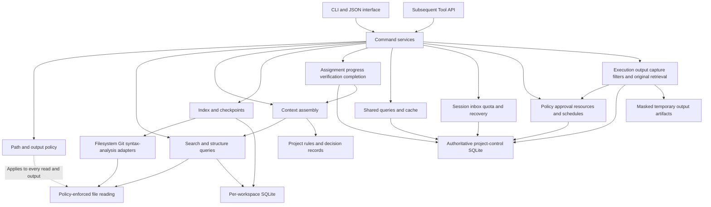

# PCTX Portable Project Detailed Implementation Specification

**Document version:** 0.6
**Date:** October 8, 2026
**Status:** Proposed design for starting implementation
**Product:** PCTX — Portable Project
**Executable command:** `pctx`
**Reference material:** Original proposal 0.2, PCTX implementation specification 0.5, the user's operating description, and official RTK, tokf, Probe, Delta, and Repomix documentation

PCTX is a general-purpose local CLI that reduces repeated exploration, transfer, coordination, and restart costs in multi-agent coding. Its foremost goal is to save tokens and credits while maintaining development quality and work continuity; project context and work progress management are the means to that end. It explores files, code structure, rules, and decisions, and assembles evidence needed for the current task into a bounded context. It supports creating work, assigning agents, reporting progress, checking test results, review, and completion without opening GitHub issue pages. Project knowledge is maintained in portable files; search indexes are rebuilt in the current workspace. The product's central purpose is to let the same project information carry over when changing agents or models.

The first public version completes **shared queries and incremental delivery, command output compression and original-record retrieval, error-driven code extraction, credit recovery, Claude Code integration, role coordination, and local work management**. PCTX manages work-state changes and test-result registration; automatically launching and directing agent processes, general semantic search, and complete call graphs belong to subsequent scope. Detailed work-management contracts are defined in Section 27, multi-session operating contracts in Sections 28–38, and command output, code extraction, staged context, source packs, and acceptance in Sections 39–45. The beSir operating structure is a replaceable project profile; Core does not fix role names, paths, vendors, or models. Commands and structures in this document are implementation targets, not statements of currently functioning product features or measured results.

## 1 Product Definition and Success Conditions

### Meaning of Portable Project

Portability has three meanings.

| Category | Product guarantee |
| --- | --- |
| Across tools | People and different agents query the same information through a conventional CLI and explicitly versioned JSON. |
| Across sessions | Rules, decisions, and checkpoints are separate from conversation. A new session reconstructs the information it needs. |
| Across environments | Project-relative paths and text files can be moved. On another computer, local paths are rebound and indexes rebuilt. |

Portability does not include automatically replicating execution environments, secrets, uncommitted source code, or model conversation history. Identical analysis results across operating systems require the same PCTX version, analyzer versions, configuration, and file contents.

### Primary Users and Scenarios

| User | Need | Result provided |
| --- | --- | --- |
| Developer | Find where to modify an unfamiliar project. | Path and symbol candidates, evidence locations, and read commands |
| Coding agent | Obtain task information within a given budget. | Context containing rules, relevant code, change information, and omission reasons |
| Reviewer | Inspect code and tests related to a change. | Change lists, observable relationships, and verification gaps |
| Person or agent taking over work | Recover previous work state and evidence. | Handoff records and differences from current files |
| Automation environment | Query project information consistently. | Stable JSON, exit codes, and freshness states |
| Project owner | Manage work and agents without opening GitHub. | A local work board, assignees, phases, blocking reasons, last reports, and completion evidence |

### Success Conditions

1. Given the same input files and configuration, item order and context bodies are reproducible.
2. Stale location information never returns a different code fragment as a normal result.
3. In-progress changes from another workspace of the same repository never contaminate current results.
4. Reducing input tokens does not worsen task success or total cost.
5. Basic exploration and context assembly work without Git, agents, or network connections.
6. Unsupported capability, no results, out-of-scope requests, and insufficient budget have distinct explanations.

## 2 Review of the Earlier Proposal and Improvement Decisions

Retain the original separation of Core and Adapters, local execution, data minimization, and evaluation of actual task cost. Revise the following points for implementability and reliable results.

| Earlier proposal | Implementation gap | Revised decision |
| --- | --- | --- |
| `find "인증 처리"` ("authentication handling") | No method connects a Korean request to English identifiers. | MVP provides lexical search and explicit aliases; it does not claim automatic semantic linkage. |
| Analysis levels L0–L5 | A higher level could be mistaken for including all lower-level features. | Replace levels with feature capabilities and per-language support matrices. |
| Verified and Stale displayed as a single state | Evidence type and freshness are separate. | Separate `evidence_status`, `freshness`, and `coverage`. |
| `context_complete: true` | Search cannot easily prove that all information needed for a task exists. | Report only completion of the selected exploration scope and omission reasons. |
| Full-text search without storing full code | A full-text index may retain code words. | Permanent indexes store metadata only; body searches read original files. |
| Common Base and Workspace Overlay | Early implementation complicates merging, locking, and invalidation. | Isolate code indexes in per-workspace databases. Initially provide caching/single collection for repeated Git and issue queries and identical-content analysis. Full Base/Overlay implementation comes later. |
| Role-based information selection | Easily mistaken for access control. | Roles weight ranking. Operating-system permissions and separate policy govern actual file access. |
| Deliver only changes since a checkpoint | A new session has never received the previous body. | Separate change queries from full handoff; never acknowledge receipt automatically. |
| Direct dependencies for impact analysis | Change impact usually runs in the reverse dependency direction. | Distinguish dependencies from dependents and specify traversal direction. |
| Initial performance targets | No hardware or dataset size was specified. | Define reference corpora, load conditions, latency distributions, and quality evaluation. |
| Work management depends on external systems | Users must move between GitHub issue pages; agent state is scattered across conversations. | Make PCTX the source of local work state and integrate assignment, reports, tests, review, and completion. GitHub integration is optional. |

## 3 Release Scope

### Version Distinctions

Document version 0.6 is separate from product release versions. Develop against the product scope below.

| Area | v0.1 MVP | v0.2 | v0.3 and later |
| --- | --- | --- | --- |
| Project detection | Explicit root; Git and ordinary directories | Multi-root workspace | Remote-resource integration |
| Search | Path, identifier, body, Boolean search; error-location batch extract | Bounded structural predicates and search-quality tuning | Optional embeddings and semantic search |
| Code structure | Syntax structure for Python, JS, JSX, TS, TSX | Additional language adapters | Precise language-server analysis |
| Relationships | Symbol definitions within files | Statically resolvable imports and explicit document relationships | References, calls, services, and contracts |
| Context | Rules, change seeds, detail selection, budgets, minimal role packets, and acknowledged deltas | Bounded import-graph expansion and improved reuse quality | Optional model-based reranking |
| State preservation | Checkpoints, handoffs, backup/restore of authoritative work records | Metadata export and explicit source packs | Remote collaboration-state service |
| Command output | Explicit run/check-runner compression, TOML filters, masked uncompressed records, savings measurement | Additional runners and verified automatic-wrapper integrations | Optional external-filter adapter |
| Work management | Tasks, verification, board, shared GitHub reads, issue mapping | GitHub write synchronization and PR-action wrapper | Real-time collaboration across devices |
| Agent status | Session epoch, run, state reports, leases, inbox/ack, Claude Code adapter | Additional runtime adapters and Tool API | Optional model execution scheduler |
| Verification and completion | External reports, explicit check runner, resource locks, target fingerprints, profile-specific completion gates | Additional CI providers | Advanced verification-plan optimization |
| Parallel work | Per-workspace code isolation, content cache, host-wide heavy lock and auxiliary-agent slots | Stronger remote execution permissions and limits | Consider immutable Base and Overlay |
| Cost and recovery | Usage/quota separation, reserve, automatic metadata capsule, restart validation | More providers and prediction correction | Verified optional model routing |
| Operating coordination | Roles, lanes, approval queue, quiet inbox, restartable schedule definitions | External notification transport | Multi-host operation |
| Integration | CLI and JSON | Read-oriented Tool API or MCP integration | Authenticated remote integration |

### Mandatory MVP Features

MVP includes `init`, `status`, `doctor`, `index`, `find`, `outline`, `read`, `build`, `checkpoint`, `changes`, `handoff`, and `task`, `agent`, `check`, `board`, `activity`, `control backup`, `control restore`. Rules and decisions are stored as Markdown and JSON; work, assignment, execution, and verification histories live in a separate control database that reindexing does not delete. All core commands work without a persistent daemon. Periodic checks and notifications while waiting use an explicitly installed local scheduler bridge; file watching is an optional optimization. Automatic plugin installation and cloud synchronization are unnecessary. Initial mandatory extension commands are defined in Sections 38, 40–43, and 45. `run`, `output`, `filter`, `extract`, and `savings` reuse the existing runner, reader, and control layers.

`refs`, `trace`, `impact`, `export`, `import`, `pack`, bounded structural `query`, and `serve` are subsequent commands. In MVP they return `CAPABILITY_UNAVAILABLE`. Body-string matches are not represented as exact symbol references.

### Exclusions

- Autonomous code edits, commits, deployment, or model-session startup. Explicit run/check commands registered and trusted by the user, output processing, and resource locks are included initially. Scheduled queries and notifications run without starting an LLM; executions that wake a model or write externally require separate permission checks.
- Complete conversation storage, external credentials stored in project files, and automatic source-code backups. Authentication references existing credential helpers; optional backup of authoritative work records, operating capsules, and settings is supported.
- Type inference and dynamic execution-flow analysis for every language.
- Multiple devices jointly writing one SQLite database on a network filesystem.
- A security boundary that blocks file access outside PCTX.

## 4 Core Usage Flows

### Exploring a Newly Installed Project

This flow shows v0.1 target commands. Initialization prepares configuration and storage; analysis runs separately.

```bash
pctx init --root .
pctx index update
pctx status --format json
pctx find auth --kind symbol --limit 20
pctx outline src/auth.ts
pctx read src/auth.ts --lines 20:65
pctx build --task "Fix session expiration handling" --seed src/auth.ts --budget-bytes 12000
```

`find` does not output code bodies by default. `outline` returns structure; `read` returns selected bodies. `build` combines user-provided seeds, search candidates, and project rules.

### Resuming a Session and Handoff

```bash
pctx checkpoint create --name before-session-fix
pctx changes --since before-session-fix --format json
pctx handoff create --from-file notes/session-fix.md --name session-fix
pctx handoff show session-fix --validate --format json
pctx build --handoff session-fix --budget-bytes 16000
```

A checkpoint is a baseline for comparing file states. A handoff records the goal, completed and unfinished work, evidence, and next actions. Test-success statements in the record remain the author's claims; they are not labeled results directly executed by PCTX.

### Unsupported Languages

```bash
pctx find payment --kind text --scope legacy/
pctx read legacy/payment.xyz --lines 1:80
pctx outline legacy/payment.xyz --format json
```

The first two commands work on ordinary UTF-8 text. The last returns unsupported structural-analysis status. Words found by regex are not presented as function definitions.

## 5 System Architecture



### Module Responsibilities

| Module | Responsibility | Prohibited behavior |
| --- | --- | --- |
| CLI | Validate arguments, select commands, output formats, exit codes | Implement SQL or language-analysis logic directly |
| Application | Command execution order and error conversion | Use human-readable output strings as internal contracts |
| Domain | Identifiers, scopes, evidence, freshness, context models | Couple to absolute OS paths or external tools |
| Policy | Path permissions, sensitive-pattern checks, output limits | Interpret role names as access permissions |
| Storage | Generation-based indexes, atomic updates, migrations | Establish freshness without reading current files |
| Adapters | Enumerate files, Git status, syntax analysis | Automatically execute commands from repository settings |
| Context | Collect/rank candidates, deduplicate, allocate budgets | Invent unverified facts in natural language |
| Work Control | State transitions and events for task/agent/run/check/review | Delete work history during reindexing or use heartbeat as completion evidence |
| Query Broker | Shared Git/external-status queries, coalescing, versioned caches | Mix worktree changes or treat query failures as empty results |
| Session and Budget | Epoch, receipt ledger, mailbox, usage, quota, recovery capsule | Count missing usage as zero or inherit receipt state across sessions |
| Operations | Role policy, approval queue, host resource locks, schedule reconciliation | Bypass approval or infer process death solely from lock expiry |
| Output Pipeline | Existing-runner capture, parser/filter/budgets, uncompressed retrieval, measurement | Change command semantics, hide failures, promote presentation to completion evidence |
| Pack | Optional source plan/manifest/splitting/integrity checks | Expand metadata-export defaults, automatically upload or overwrite source |

Initially implement a single executable with library boundaries. Do not introduce microservices or a separate search server. Internal interfaces default to synchronous APIs; only file-level parallel analysis uses a bounded worker pool.

### Proposed Implementation Technologies

| Component | Choice | Reason and conditions |
| --- | --- | --- |
| Core language | Rust | Selected for standalone binary distribution, path/concurrency handling, and controlled resource use. Reevaluate at startup if team proficiency is insufficient. |
| CLI and serialization | clap, serde, serde_json | Separate argument validation from structured-output contracts. |
| Configuration | TOML | Small project configuration with comments. |
| Local database | rusqlite and bundled SQLite | Avoid depending on users' system SQLite installation. |
| File enumeration | ignore-family library | Reuse ignore support and add PCTX security exclusions. |
| String search | Rust regex and streaming file reads | Basic functionality without a separate `rg` executable; regex requires an explicit option. |
| Structural analysis | Tree-sitter and pinned language grammars | Extract functions, classes, and syntax ranges. Type/runtime semantic analysis is separate. |
| Content identity | SHA-256 | Reproducible fingerprints for files, configuration, and results. |
| Testing | Unit, fixture integration, command contracts, performance harness | Verify correctness, recovery, isolation, and quality separately. |

Tree-sitter provides syntax trees and incremental parsing; it alone does not establish exact references or call targets throughout a project. [Official Tree-sitter documentation](https://tree-sitter.github.io/tree-sitter/)

Pin crate and grammar versions in the lockfile and record their version fingerprints in analysis results. Implement bundled SQLite distribution and ignore handling against each library's official documentation. [rusqlite](https://docs.rs/rusqlite/latest/rusqlite/), [ignore](https://docs.rs/ignore/latest/ignore/), [clap](https://docs.rs/clap/latest/clap/)

## 6 Project Detection and File Layout

### Determining the Project Root

Root precedence is explicit `--root`, the nearest ancestor `.pctx/config.toml`, the nearest Git worktree root, then the current directory. Before `init`, detection may be displayed, but no index is created implicitly. Nested repositories and submodules are separate projects and excluded from default traversal.

Directories without Git use file enumeration and content hashes. Git worktrees distinguish the common repository path from the working directory. Branch names are state information, not permanent workspace identities.

### Shareable Files and Local Derived Data

```text
project/
  .pctx/
    config.toml
    ignore
    glossary.toml
    rules/
      project.md
    decisions/
      0001-context-storage.md
    handoffs/
      session-fix.md
  src/
  docs/

<OS user data directory>/pctx/
  registry.json
  controls/<coordination-id>/
    control.sqlite3
    backups/
  workspaces/<workspace-id>/
    index.sqlite3
    writer.lock
    checkpoints/
    staging/
    logs/
```

Shared `.pctx` files are authoritative records suitable for version control. Indexes, checkpoints, and logs are local derived data, normally outside the repository. The control DB is the permanent authoritative record of user-authored work, assignments, progress, and verification, separate from the index. `.pctx/handoffs` is created only on explicit user action. Checkpoints may be deleted/recreated, but rules, decisions, handoffs, and the control DB are never targets of index GC or rebuild cleanup.

Local storage follows OS conventions and can be changed with `PCTX_DATA_DIR`. `status` shows actual locations. Absolute OS paths are stored only in the local registry; default JSON and portable documents use project-relative paths.

### Identifier Rules

- `project_id`: UUID generated by `init` and stored in configuration. Can represent the same project lineage across clones, but is not authentication.
- `workspace_id`: UUID bound to a canonical root by the local registry. Different clones/worktrees receive different values.
- `generation_id`: UUID of a successfully published index generation. Do not infer ordering from it.
- `file_key`: Root identifier combined with original relative path. Preserve spelling independently of OS case rules.
- `symbol_id`: Derived from file content hash, parser fingerprint, kind, qualified name, and byte range. A version-specific ID that may change after edits.
- `symbol_locator`: Rediscovery hint containing relative path, qualified name, and kind. Never select automatically if ambiguous.

When a project directory moves, `init` preserves existing configuration and establishes a new local binding. Initially, old index databases are not automatically reused; analysis runs again. Authoritative work records are not arbitrarily copied: explicitly reconnect the same local control binding or transfer through control backup/restore. Recheck project ID when another project occupies the same path, avoiding mistaken reuse of an old binding.

### File and Path Boundaries

MVP handles UTF-8 text and filenames representable in UTF-8. Skip unsupported encodings, binaries, and files exceeding the default 1 MiB, reporting reasons. Configuration may adjust this limit; result-size limits remain separate.

Do not arbitrarily lowercase stored names or normalize Unicode for comparison. Reject requests escaping the root through `..`, absolute paths, or drive changes. Do not follow symbolic links or Windows reparse points by default. If filenames collide on another OS, fail during transfer instead of silently overwriting.

## 7 Configuration and Policy

Example v0.1 configuration follows. Actual project IDs are generated during initialization.

```toml
schema_version = 1

[project]
id = "3f38e5ab-2d30-4be1-9694-c597eabec5f3"
name = "sample-project"

[index]
max_file_bytes = 1048576
languages = ["python", "javascript", "jsx", "typescript", "tsx"]
follow_symlinks = false

[search]
default_limit = 20
max_candidates = 200
case = "smart"

[context]
default_budget_bytes = 12000
max_snippet_lines = 80
profile = "implementer"

[policy]
exclude = ["**/.env", "**/.env.*", "**/*.pem", "**/*.key", "data/private/**"]
network = "deny"
persist_source = false

[roles.implementer]
code_weight = 1.0
tests_weight = 0.9
decisions_weight = 0.7

[roles.reviewer]
code_weight = 0.8
tests_weight = 1.0
decisions_weight = 0.9
```

Ordinary-setting precedence is CLI, environment, project settings, user settings, built-in defaults. Security exclusions and explicit denies are combined by union; roles and CLI options cannot relax them. A project with `network=deny` disables connectors too. Enabling a connector requires explicitly changing the project to `network=configured`; available functions are the intersection with destination/action allowances in the user's trust store. `configured` does not authorize arbitrary networking.

Git ignore and `.pctx/ignore` define exploration scope. `--include-ignored` relaxes only those exploration exclusions; `.git` internals and security exclusions remain blocked. Hidden files are excluded by default, except designated shared `.pctx` documents and explicitly registered rules, after policy checks.

Project configuration cannot contain automatically executed shell strings, executable templates, or automatic-install URLs. An explicit check runner runs only after reviewed argv, cwd, environment allowlist, and script hash are registered in the user's trust store. Cloning or running `init` must never imply consent to execute repository-owner commands.

v0.1 rejects `policy.persist_source=true` as unsupported. Keep default `network=deny`; permit destinations/functions for installed connectors such as GitHub reads through separate user policy. Project settings or role documents alone cannot expand network or execution permissions.

Indexes never store complete source, complete comments, or function-default literals. Symbols mainly store name, kind, and range. Document headings and paths may contain secrets; metadata must also be inspected.

## 8 Reliability Model and Common Data Contracts

### Three Independent States

| Field | Values | Meaning |
| --- | --- | --- |
| `evidence_status` | `observed`, `inferred`, `unknown` | Direct observation, inference, or lack of evidence for judgment |
| `freshness` | `current`, `stale`, `unchecked`, `missing` | Original-content agreement at the stated validation scope/time |
| `coverage.status` | `complete`, `partial`, `unsupported` | Whether execution completed for the requested scope/capability |

Even an `observed` import statement does not completely prove runtime dependencies. `coverage=complete` means supported analysis finished within the requested scope, not that the entire project's semantics are understood. MVP provides no numerical confidence: avoid unsupported numbers such as 0.93 appearing to be objective probabilities.

### Locations and Evidence

Locations contain project-relative path, file SHA-256, zero-based half-open UTF-8 byte range `[start_byte,end_byte)`, and one-based start/end line numbers. `read --lines A:B` includes both endpoint lines. CRLF byte offsets refer to actual original bytes.

Evidence records contain `file_hash`, `range`, `extractor`, `extractor_version`, `rule_id`, and `observed_at`. Long-lived evidence stores original locations instead of code text. Symbol reads use stored ranges only when hashes agree.

### Common JSON Envelope

Example `find` output follows. IDs/hashes are examples, not actual analysis results. All structured output uses this envelope.

```json
{
  "schema_version": "1.0",
  "command": "find",
  "status": "ok",
  "project_id": "3f38e5ab-2d30-4be1-9694-c597eabec5f3",
  "workspace_id": "ws-example",
  "generation_id": "gen-example",
  "validation": {
    "mode": "matched",
    "scope": ["src/auth.ts"],
    "checked_at": "2026-10-08T08:00:00Z",
    "workspace_atomic": false
  },
  "coverage": {
    "status": "partial",
    "reasons": ["candidate_universe_not_revalidated"]
  },
  "data": {
    "items": [{
      "kind": "symbol",
      "path": "src/auth.ts",
      "name": "refreshSession",
      "location": {"start_line": 20, "end_line": 42},
      "evidence_status": "observed",
      "freshness": "current",
      "reason_codes": ["alias_match"]
    }]
  },
  "truncation": {"truncated": false, "reasons": []},
  "warnings": [],
  "errors": []
}
```

`status` is `ok`, `partial`, or `error`. Errors contain stable `code`, human-readable `message`, `retryable`, and optional `details`. Detailed `data` schemas are command-specific. Clients must be able to ignore unknown optional fields; changes to required-field meaning increment the schema major version.

`generation_id` identifies the index baseline, not freshness of live original reads. Explicit `workspace_atomic=false` avoids claiming every file in one command represented the same instant of filesystem state.

## 9 Index Storage Model

### Logical Tables

This is the baseline MVP migration model. Validate schemas for JSON-array fields. Add tables for later features when implementing them.

| Table | Main fields | Constraints and purpose |
| --- | --- | --- |
| `workspace_meta` | project_id, workspace_id, active_generation_id, db_schema_version | One DB belongs to one workspace. |
| `generations` | id, parent_id, state, started_at, completed_at, config_hash, policy_hash, parser_set_hash, git_head | States: building, ready, failed. Query ready only. |
| `file_versions` | id, relative_path, content_hash, size_bytes, mtime_ns, language, parse_status, parser_hash | Reuse analysis for identical path/content/analyzer combinations. |
| `generation_files` | generation_id, relative_path, file_version_id | Composite primary key of generation/path; current file-set manifest. |
| `symbols` | id, file_version_id, parent_symbol_id, kind, name, qualified_name, start_byte, end_byte, start_line, end_line | Do not store original text or function bodies. |
| `document_sections` | id, file_version_id, heading, heading_level, start_byte, end_byte, section_kind | Distinguish ordinary documents, rules, and decisions. |
| `definition_edges` | file_version_id, symbol_id, evidence_id | MVP file-defines-symbol relationship. |
| `evidence` | id, file_version_id, range, extractor, version, rule_id | Always bind evidence to the file hash. |
| `search_metadata` | item_id, file_version_id, kind, path_terms, name_terms, heading_terms | Metadata-only FTS5 index. |
| `checkpoint_registry` | id, name, manifest_path, manifest_hash, created_at | References immutable manifest files. |

`generation_files` is an immutable file set per generation. Only changed content creates new `file_versions` and analysis; unchanged files reference existing rows. MVP creates a full manifest each generation to simplify queries/recovery. Introduce delta manifests only when measured manifest-copying cost warrants it in large repositories.

Enable foreign-key validation and indexes for `relative_path`, `content_hash`, `qualified_name`, and `generation_id`. Search must join the current-generation manifest. Historical symbols remaining in FTS must not appear in current results.

Even contentless FTS5 may retain an inverted word index; it does not imply no original-text storage or confidentiality. PCTX therefore never sends code bodies into FTS. [SQLite FTS5 documentation](https://www.sqlite.org/fts5.html)

### Storage Scope and Default Retention

| Data | Default storage | Cleanup rule |
| --- | --- | --- |
| Paths, hashes, symbol names/ranges | Allowed | Keep items referenced by current and two recent successful generations |
| Code bodies, original comments, search snippets | Forbidden in permanent indexes | Request-memory processing; explicit output/pack are separate artifacts |
| Temporary search terms and build task descriptions | Not stored by default | Never written to ordinary logs |
| Explicitly registered tasks/reports/verification/reviews | Control DB | No automatic deletion; explicit archive and backup |
| Context output bodies | No automatic permanent storage | Only explicit `--output` or pack create |
| Execution output | Temporary storage after masking | Section 40 limits/TTL for explicit run/check run; retain none supported |
| Checkpoint manifests | Allowed | Remove oldest beyond default 30 days or 100 entries; retain pinned entries |
| Project rules and decisions | Explicit files | No automatic deletion |
| Handoff files | Explicit command | No automatic deletion |
| Diagnostic logs | Minimal events | Default seven days or total 10 MiB |

Index-generation cleanup cannot damage checkpoints: checkpoints carry their own path/hash comparison manifests. A long-lived checkpoint does not require retaining historical code or every analysis generation indefinitely.

### Concurrency and Storage Constraints

Default storage uses SQLite WAL on local disk: multiple readers, one writer. Updates, cleanup, and schema changes share a workspace writer lock. Default maximum wait is five seconds, then return retryable `INDEX_BUSY`.

SQLite WAL allows only one writer at a time and constrains network filesystems accessed by different hosts. Keep databases in the local user-data directory accordingly. Use SQLite 3.51.3 or later containing the documented WAL reset fix, or a distribution with that fix verified; check the actually bundled version at release. [SQLite WAL documentation](https://www.sqlite.org/wal.html)

Analyze files outside write transactions. Prepare a building generation, then atomically commit its ready transition and active-pointer replacement. Readers use the ready generation selected at startup. Do not GC generations held by active readers. Recover the last valid generation after power loss.

## 10 Index Updates and Freshness

### Initial Index

1. Validate configuration/path policy and acquire the writer lock.
2. Enumerate allowed files in deterministic path order.
3. Check each file before/after reading and compute its content hash.
4. Pass those same bytes to the analyzer, without rereading at another time.
5. Record only metadata for unsupported files; isolate analysis errors per file.
6. Build the new manifest/search metadata; validate foreign keys, counts, and policy application.
7. Publish the ready generation and active pointer atomically.

Retry at most twice if a file changes while being read. If stable content cannot be obtained, record `CONCURRENT_MODIFICATION` and exclude its structural results. Never conceal omitted files; the result is `partial`.

### Incremental Updates

Default `index update` uses size, modification time, and Git status to detect change candidates; actual hashes decide reanalysis. File-set comparison finds additions/deletions. To reliably detect changes with identical size/time, `--verify-content` hashes the entire requested scope.

Use machine-readable Git status such as `git status --porcelain=v2 -z --untracked-files=all`. Never parse filenames containing whitespace/newlines through whitespace splitting. Git status assists candidate detection; PCTX file hashes provide final content identity. [Official Git status documentation](https://git-scm.com/docs/git-status)

| Change | Handling |
| --- | --- |
| Content edit | New file version; regenerate symbols/document structure for that file |
| Deletion | Remove from new manifest; retain only in historical generations |
| Rename | Normally deletion plus addition; rename hint only for identical content |
| Branch switch | Record HEAD change; recheck file set and required contents |
| Ignore/policy change | Reenumerate full scope; immediately block queries of excluded metadata |
| Grammar change | Invalidate analysis for that language |
| Project without Git | Same behavior through enumeration/hashing |
| Merge-conflict markers | Read as ordinary text; report structural warnings/incompleteness |

Configuration alone can change analysis, so cache keys include parser/configuration/policy fingerprints as well as file hashes. Later import resolvers recompute affected resolutions when related manifests, aliases, or package configuration change.

### Query Freshness Modes

| Option | Behavior | Guarantee |
| --- | --- | --- |
| `--freshness off` | Use existing index | Freshness is unchecked; for speed measurement or candidate exploration. |
| `--freshness matched` | Validate hashes of returned candidates | Checks candidate locations, not completeness of all newly added candidates; ordinary-query default. |
| `--freshness strict` | Reenumerate/validate requested scope, update as needed, then query | Incorporates observed scope changes; not an atomic filesystem snapshot. |

With mismatched hashes in matched mode, never use stale ranges. `find` may return paths with stale warnings, but `read --symbol` and structural body reads fail with `STALE_INDEX`. Users may update or select strict. `read path --lines` reads current requested lines and returns the current hash.

Initial full `build` packets and checkpoint creation default to strict. Delta requests within the same context epoch validate the receipt baseline/change scope; watcher overflow, policy changes, or new scopes trigger full strict validation again. Strict still discloses that files were checked at different instants; recheck selected files before output. Continuing modification produces `partial` or a `--require-complete` failure. CI needing strong snapshot isolation uses an externally pinned checkout.

### Interruption and Corruption Recovery

Remove unpublished building generations on the next invocation after process termination. Determine liveness by whether the OS lock can be acquired, not mere lock-file existence. Disk exhaustion or transaction failure preserves the existing active generation.

`doctor` is read-only by default. After corruption diagnosis, `index rebuild` prepares and validates a new DB before replacement; never delete the failed DB first. Migrations run under the writer lock and preserve the original DB on failure. An executable unable to read a newer schema never downgrades it automatically.

## 11 Search and Code Queries

### Search Types

Provide `find QUERY --kind path|symbol|document|text|all`. Default `all` combines path/symbol/document-metadata search with policy-enforced body scans. Group multiple matches in a file; record which search methods matched each result.

Queries default to literals. Split camelCase/snake_case path/name tokens; smart case is sensitive only when the query contains uppercase. Body search defaults to literal substrings. Regex requires `--regex`; document supported syntax and pattern-size limits.

`find --kind text` streams original files. By default, return paths, line numbers, and match counts only; include bounded original text only with `--snippet-lines N`. Apply the same policy to ordinary search and explicit `read`. ripgrep also applies ignores and hidden/binary exclusions; match search scopes in comparisons. [Official ripgrep repository](https://github.com/BurntSushi/ripgrep)

### Natural Language and Aliases

Never assume Korean task descriptions automatically connect to English code. Support a small project vocabulary through explicit `.pctx/glossary.toml` aliases. The example maps Korean phrases for authentication, session expiration, and payment to English identifiers.

```toml
[aliases]
"인증" = ["auth", "authentication", "login"]
"세션 만료" = ["session", "expiry", "expiration"]
"결제" = ["payment", "billing"]
```

Apply aliases only to registered phrases appearing in queries, with at most 16 expansion terms. Return `expanded_terms` and each alias's source. Failure to find related English code without aliases is a lexical-search limitation, not a model error. Basic guidance includes explicit paths through `--seed`.

### Candidate Ranking

Rank generated candidates with these fixed v0.1 starting weights, versioned after evaluation.

| Signal | Score |
| --- | --- |
| Explicit seed file/symbol | 100 |
| Exact full-name match | 80 |
| Exact path-segment match | 60 |
| Name-token match | 50 |
| Document-heading match | 40 |
| Body literal match | 25 |
| User-registered alias match | 0.8 times the corresponding score |

Use the highest matching signal as a candidate's base score. Cap recent-change bonuses at 10 and role adjustments at 10; many matches must not automatically prioritize a file. Break ties by original relative path and starting byte. `--explain` returns reason codes/calculated values.

`--limit` controls returned item count; `max_candidates` caps context candidate evaluation. Report omissions when scan time, scope, or candidate limits are exceeded. If the full candidate count was not measured, use null for `omitted_count`, never an invented estimate.

### Structure and Symbol Reads

`outline` returns names, kinds, ranges, and parent symbols of functions, methods, classes, interfaces, and type declarations. Pin MVP coverage through grammar-specific fixtures. Difficult export/overload/anonymous-function cases return location-based results instead of invented stable names.

`read --symbol ID` accepts an exact version-specific ID. `--symbol-name NAME --path PATH` rediscovers by name. Multiple matches return `AMBIGUOUS_SYMBOL` and candidates. An old ID after editing must never automatically select a similar name.

File reads without `--lines` return the first 80 lines and indicate additional content. Symbol reads target the whole syntax construct by default, but mark truncated ranges beyond 80 lines or 64 KiB output. Respect limits including the JSON envelope; `--require-complete` returns an error instead of partial bodies. Users can request narrower ranges. Directory outline returns per-file structure within scope; `--depth` limits symbol nesting.

| Language/document | MVP structure extraction | Unsupported or limited analysis |
| --- | --- | --- |
| Python | Functions, async functions, classes, methods, nested declarations | Dynamic attributes, decorator execution effects, type-based references |
| JavaScript | Named functions, classes, methods, named function-valued variable declarations | Dynamic properties and runtime call targets |
| JSX | JavaScript declarations and enclosed JSX ranges | Runtime component-render relationships |
| TypeScript | JavaScript declarations, interfaces, type aliases, enums | Type checking and final overload call targets |
| TSX | TypeScript declarations and JSX ranges | Type/render semantic relationships |
| Markdown | Headings, section ranges, PCTX front matter | Automatic verification of natural-language facts |
| Other UTF-8 text | File locations and body matches | Language-specific outlines and symbol references |

Files with syntax errors expose only analyzable declarations and record `parse_status=partial`. Even successfully parsed files must not claim coverage for unsupported syntax kinds.

## 12 Context Assembly Algorithm

### Inputs and Outputs

Inputs are a task description or `--task-id`, seed paths/symbols, search scope, role, budget, and optional handoff. Temporary descriptions remain in memory. Titles, descriptions, completion criteria, and reports explicitly registered through task create persist in the control DB. `build --task-id` includes current task revision, assigned run, unmet completion criteria, and related files.

Context bodies contain, in order: task identity/registered revision, applicable mandatory rules, seeds/core code, related test candidates/recent verification state, decisions, changes, omissions, and next-query methods. Other-workspace test results retain source and target fingerprints; never turn them into passes for the current workspace. MVP does not generate model-written project summaries.

### Processing Order

1. Validate policy/scope and perform strict freshness checks.
2. Collect explicit seeds and rule documents first.
3. Gather up to 200 candidates through queries/aliases.
4. Add test candidates/documents using path/name rules; label inferred links.
5. Deduplicate by file hash and overlapping byte ranges.
6. Prepare path-only, structure-only, and bounded-body representations for each candidate.
7. Place mandatory items first, then select others by relevance relative to cost.
8. Serialize the final output format and remeasure size.
9. If over budget, downgrade representation or omit the lowest-priority optional items first.
10. Revalidate selected original hashes; return omission/freshness information.

### Rules and Deduplication

Structured mandatory rules in `.pctx/rules` may have `id`, `scope`, and `required`. Separately registered existing instruction files are reference material with original locations. Structured conflicts between mandatory rules for the same scope return `RULE_CONFLICT`; never delete one automatically. Automatic detection of arbitrary natural-language contradictions is excluded. PCTX never changes external agents' system-instruction precedence.

Include only mandatory rules matching task scope. When scope is unclear, apply global rules and mark uncertainty. If mandatory rules plus minimum state metadata exceed budget, fail with `BUDGET_TOO_SMALL`; never silently truncate mandatory content.

Deduplication keys are original hash and byte range. Merge symbol/text matches pointing to the same content and combine reason codes. Never merge changed code, differently scoped rules, or documents with different conclusions merely because sentences resemble one another.

### Budget Units

Default budgets count UTF-8 bytes. `--budget-bytes` applies to the complete final stdout document, including JSON keys/separators. Logs go to stderr; an agent wrapping the CLI as a tool may incur additional cost reading them.

`--budget-tokens N --tokenizer ID` requires an installed/registered supported tokenizer. Return tokenizer ID/version. Never claim exact counts for unknown tokenizers or unsupported models. Dividing character counts by four is not a token-upper-bound guarantee.

If both budgets are supplied, satisfy both. Iterate serialization/measurement including the lengths of budget-metadata numbers; if not stable within three iterations, reduce optional items and retry. Reject budgets smaller than the minimum error envelope as invalid arguments. Model conversation wrappers, system messages, and cache costs are outside PCTX's output budget.

### Omissions and Completeness

Return `selected_items`, `omitted_items` or omission count, `omission_reasons`, `selection_complete`, `search_coverage`, `budget.used`, and `budget.unit`. `selection_complete=true` means all evaluated candidates were included, not that task knowledge is complete.

`--require-complete` treats analysis failures in requested scope and budget failures to satisfy mandatory requests as errors. Ordinary mode may omit optional candidates with explanatory metadata. Provide seed paths/follow-up commands for further reads, without disclosing details of policy-blocked paths.

### Determinism

Identical file manifest, analyzer versions, query, scope, policy, role, budget, and tokenizer must yield identical body/item ordering. Keep nondeterministic time/request-ID fields only in the envelope. If checkpoint time affects ranking, include ranking reference time in the input fingerprint. Use these conditions for snapshot tests/context comparisons.

## 13 Checkpoints and Handoffs

### Checkpoint Data

A checkpoint is an immutable manifest with UUID, optional name, project/workspace IDs, creation time, scope, per-file relative path/SHA-256, configuration/policy/analyzer fingerprints, and optional Git HEAD. Never include code or conversation text. Default scope is the entire allowed project.

Checkpoint names are unique per workspace; never overwrite duplicates. Write a temporary file, flush, publish by atomic rename, then register it. `doctor` reports unregistered manifests from intermediate failure only as cleanup candidates.

### Meaning of changes

`changes --since CHECKPOINT` compares checkpoint manifests with current hashes in requested scope to compute added, modified, deleted, and unchanged. Without stored old source versions, MVP does not return code diffs by default.

Provide a rename hint only when exactly one old/new file pair has the same hash. Duplicates prevent definitive rename identification. If current/checkpoint scopes differ, compare their intersection and separately show scope differences. Reject checkpoints from other projects.

Comparison with Git refs is a separate later option. Never claim recovery of previous source bodies without Git or available prechange code.

### Handoff Format

`handoff create --from-file FILE --name NAME` validates user-written Markdown and stores it in `.pctx/handoffs` with these fields. Reject collisions; modify only through explicit update commands.

```yaml
schema_version: 1
id: handoff-example
name: session-fix
project_id: 3f38e5ab-2d30-4be1-9694-c597eabec5f3
checkpoint_id: checkpoint-example
source: user_provided
```

Separate goals, completed work, remaining work, changed files, verification evidence, known problems, and next actions in the body. Store all file references relatively. Without a checkpoint, create establishes a new baseline; if writing the record fails, never automatically treat the unused checkpoint as completed.

`handoff show --validate` checks current existence/hash changes of referenced files. Show old text alongside current differences. Never automatically execute recorded instructions or shell examples.

### Delivery and Acknowledgment

A successful build does not prove an agent read context. Execution or piping alone must not persist a “delivery completed” state. Distinguish file-state differences from acknowledged context differences within the same epoch; allow deltas only with validated baselines.

Implement `consumer_id`, `session_id`, `context_epoch`, `context_id`, and explicit ack initially. New sessions/epochs after compaction never inherit old acks; require a minimal full packet or validated recovery packet. Section 30 specifies deltas/receipt ledger.

## 14 CLI Command Contracts

### Common Options

| Option | Default and meaning |
| --- | --- |
| `--root PATH` | Explicit project root; relative paths use it. |
| `--format compact|json|markdown` | Default compact; markdown supported for build, outline, read, handoff. |
| `--scope PATH` | Repeatable; default entire policy-allowed project. |
| `--freshness off|matched|strict` | Ordinary queries matched; build/checkpoints strict. |
| `--limit N` | Search default 20, maximum 1000. |
| `--timeout-ms N` | Ordinary queries 10000; indexing/strict build/checkpoints 120000. |
| `--require-complete` | Abnormal exit for incomplete requested-scope execution. |
| `--no-color` | Disable color/control characters; JSON always colorless. |
| `--output PATH` | Atomic file output instead of stdout; do not overwrite by default. |
| `--explain` | Add search/selection reason codes. |

Unsupported options on a command produce argument errors rather than being ignored. Exclude YAML output from MVP and stabilize one JSON contract first. Query version with `pctx --version` and installed capabilities with `pctx status --capabilities`.

### Command Inputs and Side Effects

| Command | Key options | Result | Persistent changes |
| --- | --- | --- | --- |
| `init` | `--root` | Detected root/generated settings | Create `.pctx/config.toml` and local registry |
| `status` | `--capabilities` | Generation/capabilities/unchecked state and task/agent summaries | None |
| `doctor` | `--format json` | Permission, DB, lock, configuration, storage problems | None |
| `index update` | `--verify-content` | Changed/excluded/failed file counts | New index generation |
| `index rebuild` | None | Rebuild results | Replace with validated new DB |
| `index gc` | `--dry-run`, `--apply` | Cleanup candidates/sizes | Derived-data cleanup only with `--apply` |
| `find QUERY` | `--kind`, `--regex`, `--snippet-lines` | Candidates/evidence | Updates only as needed in strict |
| `outline PATH` | `--depth` | Supported-language structure | Updates only as needed in strict |
| `read PATH` | `--lines A:B` | Current file range | None |
| `read` | `--symbol ID` or `--symbol-name` with `--path` | Validated symbol body | Updates only as needed in strict |
| `build` | `--task`, `--task-file`, `--seed`, `--role`, `--handoff`, budget options | Context within budget | Default strict update; bodies saved only by explicit output |
| `checkpoint create` | `--name`, `--scope`, `--pin` | Checkpoint ID | Manifest/registry |
| `checkpoint list` | None | Checkpoint list | None |
| `checkpoint delete` | ID | Deletion result | Only the specified local checkpoint |
| `changes` | `--since` | File-state differences | None |
| `handoff create` | `--from-file`, `--name` | Record path/baseline checkpoint | Explicit handoff file |
| `handoff update` | NAME, `--from-file` | Updated record | Atomic existing-file replacement |
| `handoff show` | NAME, `--validate` | Record/current state | None |

Repeated `init` never overwrites existing project IDs/configuration. Never automatically modify source, Git settings, ignore files, or agent instructions. `build --task`, `--task-file`, `--task-id` are mutually exclusive; `--task-file -` reads stdin. A handoff-only build uses the recorded goal as its description.

### stdout and Exit Codes

stdout contains results only; progress/diagnostics go to stderr. JSON returns one document for success, partial success, and errors; never truncate valid JSON midway. Zero search matches are normal success with `data.items=[]`.

| Exit code | Meaning | Example errors |
| --- | --- | --- |
| 0 | Successful requested execution | Includes zero matches and explicitly permitted optional omissions |
| 2 | Input/configuration error | `INVALID_ARGUMENT`, `INVALID_CONFIG`, `AMBIGUOUS_SYMBOL` |
| 3 | Requested scope not fully processed | `PARTIAL_RESULT`, require-complete failure |
| 4 | Original state fails requested conditions | `STALE_INDEX`, `CONCURRENT_MODIFICATION` |
| 5 | Policy/access denial | `POLICY_DENIED`, `PATH_OUTSIDE_ROOT` |
| 6 | Required capability/resource unavailable | `CAPABILITY_UNAVAILABLE`, `NOT_INITIALIZED`, `CHECKPOINT_NOT_FOUND` |
| 7 | Storage/execution error | `INDEX_BUSY`, `IO_ERROR`, `DB_CORRUPT`, `TIMEOUT` |
| 8 | Even minimum context cannot fit budget | `BUDGET_TOO_SMALL` |
| 130 | User interruption | `CANCELLED` |

An unchecked candidate universe in matched mode is a stated default limitation, so normal results may accompany coverage warnings. Actual omitted execution due to read failures, requested-analyzer errors, or timeout defaults to code 3 or the applicable error code. Clients inspect the envelope as well as exit codes.

## 15 Subsequent Relationship and Impact Design

### Relationship Schema

Later relations record source entity, target or unresolved target, type, evidence-ID list, resolver fingerprint, evidence status, and generation. Unresolved imports may retain safe original-specifier metadata and resolution-failure reasons.

Directions always run from subject to object. `A imports B` means A uses B; `A tests B` claims test A verifies B. Observed imports alone never establish a tests relationship.

### Analysis Scope and Direction

`trace --direction outgoing` shows dependencies of the target. `impact` follows incoming dependencies to find items potentially affected by changing it. Default depth is 2; maximum visited nodes 1000; deduplicate cycles with a visited set.

A statically resolved import edge differs from inferred modification needs along it. Even observed edges yield impact results labeled `potentially_affected`. Export-name changes, dynamic imports, reflection, dependency injection, build aliases, and generated code remain explicit coverage gaps.

### Test Recommendations

MVP test candidates are inferred through filename/path-proximity rules. v0.2 adds explicit mappings and resolved imports. Absence of a PCTX recommendation never proves a test can safely be skipped. Actual test-selection optimization is separate and requires passing missed-test-rate evaluation.

### Language-Server Integration

Consider later LSP adapters for languages needing precise definitions/references. Specify server executable, root, timeout, environment, and trust; project settings alone cannot automatically start servers. Adapter support is limited to capabilities passing server-specific fixtures. [Language Server Protocol overview](https://microsoft.github.io/language-server-protocol/overviews/lsp/overview/)

## 16 Portability and Multiple Workspaces

### MVP Sharing Model

People/agents in one workspace may query the same index DB. Each worktree/clone has its own index DB. Worktrees attached to the same local coordination share a control DB, aggregating assignments/progress while retaining code isolation. Separate clones default to separate coordination; identical project IDs alone never merge work. Share `.pctx/config.toml`, rules, decisions, and handoffs through ordinary version control; never put whole indexes in Git.

After cloning on another computer, `pctx init` and `pctx index update` create that computer's new index. Revalidate handoff file hashes against current state if different. Missing local checkpoint IDs are reported; allow establishing a new baseline from document bodies.

### Subsequent Portable Archive Format

v0.2 `export` creates an archive of manifest, permitted settings, rules, decisions, selected handoffs, and file hashes. Defaults exclude code bodies, DBs, logs, absolute paths, and credentials. Preview the item list/policy checks before export.

`import` limits expanded size/file count; rejects absolute paths, `..`, links, duplicate paths, and OS-specific name collisions. Validate schema/checksums in separate staging, then report conflicts. Do not overwrite existing configuration/documents by default. Checksum agreement proves integrity, not author identity or content trust.

### Conditions for Shared Analysis Caches

Caches for identical-project/policy/content parsing and Git/task queries are initial features. Optimize costly duplicate parsing while measuring token savings separately from CPU savings. Keys contain project-isolation key, content hash, and parser/configuration/policy fingerprints. No global search: query only results referenced by the current workspace manifest.

Introduce immutable shared Base/Overlay only when these optimizations are insufficient. Base identifies immutable commit/analysis-environment data; Overlay represents workspace changes/deletion tombstones. Avoid requiring this structure initially, reducing MVP consistency complexity.

## 17 Security and Data Lifetime

### Threat Model

Main threats are bypass exposure of excluded files, malicious configuration, execution instructions hidden in source documents, incorrect ranges from changing files, and disclosure through logs/output/archives. PCTX cannot prevent an attacker with the same OS-user privileges from reading files directly outside PCTX.

| Threat | Default control | Acceptance method |
| --- | --- | --- |
| Relative-path escape/link bypass | Root-boundary checks, no links by default, recheck at open | `../`, symlink replacement, Windows reparse fixtures |
| Secret-file exploration | Same exclusions for indexing/direct reads | Block in find/outline/read/build |
| Credentials embedded in code | Sensitive-pattern checks before metadata storage/snippet output | Synthetic-token fixtures prove storage/output absence |
| Commands in repository configuration | No execution from project settings alone; user trust binding and argv/capability checks | No shell-metacharacter reinterpretation or wrapper permission expansion |
| Document prompt injection | Treat original text as attributed data; no automatic execution | Documents with instructions never trigger execution |
| Arbitrary networking | Core disabled by default; connectors have explicit host/permission allowlists | Full local functionality offline; external state marked unavailable |
| Log disclosure | No query/body/environment in diagnostics; explicit execution records masked/bounded | Split-secret, artifact-TTL, reread-policy checks |
| Import archive attack | Staging, size limits, path validation | Traversal, decompression-bomb, link fixtures |

Sensitive detection reduces known-pattern risk; it does not promise 100% detection of arbitrary personal information or new credential formats. Exclude high-protection files by path. If masking changes code, mark `redacted=true` and avoid presenting it as identical to original source.

`--task-file` and `handoff --from-file` may accept external paths because users explicitly select those input documents. Never expand this exception to source exploration/symbol reading. Apply size, encoding, and sensitive-data checks to input documents too.

### Permissions and Trust Boundaries

Create local data directories with user-only permissions on supported OSs. `doctor` warns about overly permissive existing directories. On Windows, check user-centered ACLs. This does not replace full-disk encryption or OS-account separation.

Project configuration may narrow search but cannot weaken higher user security policy. Network/external-execution adapters require explicit separate user activation. Role changes do not affect this boundary.

### Policy Changes and Deletion

Immediately block currently forbidden items in every query even if still present in old DBs. Next reindex/cleanup removes their metadata/FTS entries. For strong protection, advise `index rebuild` and old-cache cleanup immediately after policy changes.

Deleting SQLite rows does not guarantee physical removal of historical data. VACUUM may remove deleted DB traces, but cannot guarantee erasure from WAL, backups, OS snapshots, or SSD remnants. [SQLite VACUUM documentation](https://www.sqlite.org/lang_vacuum.html)

Cache cleanup never deletes user-created context outputs, handoffs, Git history, control DBs, or work-history backups. Dry runs distinguish cleanup targets/scopes.

## 18 Performance and Resource Targets

### Reference Environment and Datasets

These are implementation targets, not measurements. Initial reference hardware: eight CPU cores, 16 GiB memory, local SSD, no network. Record CPU, OS, filesystem, and PCTX version for CI performance runners; never combine macOS/Linux/Windows figures.

| Dataset | Included text files | Total analysis input | Purpose |
| --- | --- | --- | --- |
| S | 1000 | 20 MiB | Ordinary features and cold start |
| M | 10000 | 200 MiB | MVP performance acceptance |
| L | 100000 | 2 GiB | Observe scalability; excluded from mandatory MVP performance acceptance |

Counts/sizes are after policy application. M defaults to 60% supported languages, 20% documents, 20% other text; also fix symbol counts, average line length, and maximum file size. Distinguish secret-free synthetic fixtures from redistributable public-project snapshots.

### Initial Performance Budgets

| Measurement | M target | Conditions |
| --- | --- | --- |
| Initial full index | At most 90 seconds | Includes hashing/supported-language analysis |
| Incremental update of 20 files | p95 at most 3 seconds | Includes full enumeration, excludes full rehash |
| Metadata search | p95 at most 250 ms | Warm cache, freshness off, 20 results |
| Matched symbol search | p95 at most 700 ms | Includes candidate hashing, 20 results |
| Body search | p95 at most 2 seconds | Full 200 MiB scan, warm OS cache |
| Context selection/serialization | p95 at most 800 ms | 200 candidates, validated index, 12000 bytes |
| Complete strict build | p95 at most 15 seconds | Enumeration/hash/selection/final validation, no changes |
| Peak process memory | At most 512 MiB | Large-file limits and worker pool |
| Active DB plus WAL | At most 400 MiB | Current/previous successful generations only; logs/checkpoints separate |

Strict build/checkpoints default to 120-second timeouts, distinct from ordinary queries' ten seconds. Never silently omit freshness checks to meet targets. If over target, measure cost components and adjust scope limits, parse caching, and serialization.

Warm measurements use a preparation run followed by at least 30 repetitions, reporting p50/p95/max. Measure cold conditions on separate runners with controllable OS caches; keep cold/warm results separate. A single measurement cannot establish performance achievement.

## 19 Accuracy and Token-Cost Evaluation

### Search Evaluation

Prepare at least 60 queries with labeled relevant files/symbols/documents, including exact identifiers, partial names, Korean aliases, no-answer queries, and unsupported languages.

Target exact-identifier Recall@20 of 100%. For others, record Recall@20, MRR, incorrect-location rate, and unsupported-as-empty rate. Separate natural-language quality by alias availability; never present it as semantic-search performance.

### Actual Task Comparison

Compare at least ten bug fixes, ten small feature changes, and ten review/impact tasks on identical repository snapshots/completion criteria. Baseline uses enumeration/search/direct reads; treatment gives the same agent PCTX query tools. Allow extra exploration whenever needed in both arms, including every additional cost.

Fix model/version, agent execution configuration, maximum task time, completion checks, and tool-output policy. Alternate execution order per task; repeat each at least three times. Reset session memory/file changes. Separate model-cache conditions and index-preparation cost into cold/warm experiments.

### Measurement and Acceptance

| Metric | Measurement | Initial judgment |
| --- | --- | --- |
| Input tokens | Actual model usage; cached/uncached separated | Target paired-task mean reduction of at least 20% |
| Output tokens | Actual model output usage | Include all in cost |
| Total model cost | Run-time price tables and actual usage | Target lower average cost |
| Task success | Hidden tests or predefined review rubric | No point-estimate decline; additional noninferiority evaluation |
| Completion time | First request through final verification | Report exploration benefit and preparation costs together |
| Rework rate | Retries after failed verification or edits from wrong evidence | Report increase relative to baseline |
| Index cost | Time, CPU, disk, memory | Separate initial and amortized repeated-use costs |
| Original-validation failures | Stale locations returned as normal code | Zero fixture cases |

Agents without actual usage expose only observable metrics such as output bytes/search-call counts. Never relabel them measured token savings. Provider/agent usage collection belongs to external evaluation adapters; Core accesses neither conversation nor accounts.

The experimental unit is the task. Never count repeated runs of one task as independent tasks to inflate confidence. Compute token/cost reduction intervals using task-level paired bootstrap. Evaluate success-rate differences with a 95% confidence interval against the predefined -5 percentage-point noninferiority margin. If 30 tasks are insufficient, leave judgment pending and add tasks.

Separate product-distribution criteria from savings-promotion criteria. Safety, accuracy, and command contracts may permit an experimental release; token-savings figures cannot become guarantees before results exist.

## 20 Feature Acceptance Criteria

| ID | Scenario | Pass condition |
| --- | --- | --- |
| AC01 | Initialize new directory without Git | Init/search/index/context work without Git-unsupported errors |
| AC02 | Initialize same project twice | Preserve project ID and user-edited configuration |
| AC03 | Create/edit/delete/rename | New manifest precisely reflects current file set |
| AC04 | Content changes with same size/mtime | strict/verify-content detect changes; no stale snippets |
| AC05 | File changes during parsing/before output | Retry or explicit error; never return wrong ranges normally |
| AC06 | Two worktrees of one repository | Uncommitted symbols appear only in their own workspace |
| AC07 | Ten readers/two writers concurrently | One writer commits; readers see ready generations only; retry errors structured |
| AC08 | Forced termination/disk exhaustion during update | Preserve previous active generation; recovery on rerun |
| AC09 | Request excluded paths through every query | No policy bypass in DB queries/direct reads |
| AC10 | Symlink replacement/relative escape | No contents outside project returned |
| AC11 | Duplicate symbol names/old IDs | Ambiguous/stale errors; no arbitrary selection |
| AC12 | Korean/CRLF/emoji/space/newline filenames | Byte/line locations agree where supported; unsupported names explicitly excluded |
| AC13 | Small budgets/JSON | Valid JSON and final limit, or BUDGET_TOO_SMALL |
| AC14 | Mandatory rules exceed budget | Fail without silently truncating rules |
| AC15 | Repeat build with identical input | Same body/order except nondeterministic envelope fields |
| AC16 | New session uses old checkpoint | Can produce current full context without assuming prior receipt |
| AC17 | Query old DB after policy change | Newly forbidden information immediately blocked |
| AC18 | Unsupported language/zero results | Distinguish unsupported from normal empty |
| AC19 | Newer DB/failed migration | Error without corruption; no automatic downgrade |
| AC20 | Validate handoff | Separate author claims from original-file validation |
| AC21 | Offline environment | All mandatory local commands work; connectors return unavailable or time-stamped cache |
| AC22 | Same fixtures on three major OSs | Matching structure/context except path presentation |
| AC23 | Work flow without GitHub/network | PCTX manages create/assign/start/report/verify/review/complete |
| AC24 | Two runs concurrently claim task | Exactly one succeeds; existing run preserved; structured conflict |
| AC25 | Local worktrees/separate clone | Shared worktree board with code/run targets separate; clone isolated by default |
| AC26 | Heartbeat stops | Stale/lease expired; no automatic completion/reassignment |
| AC27 | Old run reports after reassignment | Reject modifications from old lease epoch |
| AC28 | Code/completion criteria change after tests pass | Evidence stale; completion gate blocked |
| AC29 | Agent merely claims success | Unverified claim; no mandatory verification pass |
| AC30 | Report has zero tests/failure/cancellation/incompleteness | Cannot serve as successful completion evidence |
| AC31 | Reviewer approves another revision | Cannot complete current revision |
| AC32 | Repeated report/reordered events | Idempotent, no duplicates; old report cannot overwrite latest phase |
| AC33 | Dependency cycle/scope change | Block cycles; invalidate related acceptance/verification |
| AC34 | Board after index GC/rebuild | Preserve authoritative tasks/runs/verification/reviews/events |
| AC35 | Concurrent state change just before completion | CAS transaction blocks completion from stale state |
| AC36 | Control backup/restore | Preserve work/history; formerly live runs interrupted; tokens/leases not reusable |
| AC37 | Paused/blocked/100% checklist | Separate from task done; progress alone cannot complete |
| AC38 | Watch disconnect/reconnect | Recover events after cursor; heartbeat does not change task completion rate |

Unit tests check ranking, deduplication, budgets, paths, and schemas. Integration tests use actual temporary files/DBs for updates, recovery, concurrency. Command-contract tests check exit codes, stdout JSON, stderr separation. Platform tests run on actual supported-OS runners.

## 21 Development Stages and Work Breakdown

### Staffing and Schedule Assumptions

Use stages with acceptance conditions, not time promises. First validate vertical features reducing repeated queries, delivery, and restart cost on the current Mac/Claude Code multi-session environment, then apply the same Core to other projects/OSs. Owner reports show completed/blocked work and needed decisions, never invented completion estimates. Stage scope/acceptance follow this section and Section 38.

| Stage | Priority implementation | Deliverables and pass conditions |
| --- | --- | --- |
| M0 Baseline/integration | Current operating inventory, profile validation, usage baseline, minimal schema | Shadow observation without changing existing permissions/locks/cron |
| M1 First savings path | Shared Git/task queries, brief, session epoch/delta, Claude adapter | Multiple sessions requesting identical state reduce collection/output without omission |
| M2 Work/recovery | Control DB, task/run/inbox, quota state, automatic capsule/resume | Resume after credit exhaustion/forced termination preserving originals/deny policies |
| M3 Safe coordination | Roles/approval queue, heavy-lock bridge, auxiliary slots, schedule reconcile | No duplicate questions, concurrent heavy execution, automatic restart of deferred roles |
| M4 Search/verification integration | Language structure/extract, check runner/output compression/filters/original retrieval, acceptance/PR/deploy evidence | Pass v0.1 subset of AC01–74, AC76–77, AC81–82 |
| M5 Generalization/distribution | Other repositories/manual adapters/three OSs; savings/compression ablations | No project values in Core; success/total-cost evaluation passes; v0.2 graph/pack add AC75, AC78–80 |

Move shared read-only GitHub access, Claude Code integration, explicit check runner, lock bridge, and metadata handoff into initial savings validation. GitHub writes/PR wrappers, general remote MCP, semantic search, automatic model execution, and advanced call graphs follow later. Manual links to current gh/deploy tools must still permit observing initial-profile policy/state. If quality falls short, reduce advanced analysis while retaining isolation/recovery/approval principles.

### Immediately Registerable Implementation Work

| Work ID | Implementation unit | Dependencies | Completion conditions |
| --- | --- | --- | --- |
| PCTX01 | CLI skeleton, JSON envelope, errors | None | help/version/invalid-argument contracts |
| PCTX02 | Root detection/project-workspace registry | PCTX01 | Git/ordinary-folder/nested-root fixtures |
| PCTX03 | Configuration merge/path policy | PCTX02 | Policy strengthening/ignore exceptions |
| PCTX04 | Safe walker/file reader | PCTX03 | Links/encoding/size/concurrent reads |
| PCTX05 | Literal/regex body search | PCTX04 | Scope/count/timeout/snippet masking |
| PCTX06 | Migrations/generation store | PCTX02 | Atomic active pointer/corruption recovery |
| PCTX07 | Hashes/incremental indexer | PCTX04·06 | Create/edit/delete/branch switch |
| PCTX08 | Outlines for five grammar variants | PCTX07 | Grammar-specific golden fixtures |
| PCTX09 | Metadata search/aliases | PCTX08 | Ranking/reasons/determinism |
| PCTX10 | Freshness modes/symbol read | PCTX07·08 | Prevent stale byte-range use |
| PCTX11 | Rules/decision loader | PCTX03·04 | Scope/mandatory rules/conflicts/original attribution |
| PCTX12 | Context selector/serializer | PCTX09·10·11 | Byte budgets/deduplication/omissions/valid JSON |
| PCTX13 | Tokenizer interface/optional implementation | PCTX12 | Explicit unsupported errors/exact-tokenizer regression |
| PCTX14 | Checkpoint/changes | PCTX07·10 | Immutable manifests/hash comparison/scope differences |
| PCTX15 | Handoff create/update/validate | PCTX11·14 | Preserve originals/author claims/change validation |
| PCTX16 | Doctor/GC/locks/interruption | PCTX06·07·14 | Read-only diagnostics/dry-run cleanup |
| PCTX17 | Performance/quality harness | PCTX05·09·12 | Reference corpus/reproducible reports |
| PCTX18 | Distribution/docs/license notices | PCTX16·17·27·39·48 | Initial Mac adoption, then generic Core installation and supported-adapter examples on three OSs |
| PCTX19 | Coordination detection/control migrations | PCTX02·06 | Shared local-worktree board/clone isolation |
| PCTX20 | Tasks/checklists/dependencies/revision | PCTX19 | State transitions/DAG cycle prohibition/concurrent-update conflicts |
| PCTX21 | Agent registration/assignment/run/lease | PCTX20 | No duplicate claims; heartbeat/reassignment/stale-report protection |
| PCTX22 | Progress events/idempotent commands | PCTX21 | Deduplicate events/reordering/retries |
| PCTX23 | Check reports/artifact fingerprints | PCTX10·22 | Result source, target/environment/policy matching, staleness |
| PCTX24 | Review/acceptance/completion gate | PCTX20·23 | Self-approval limits/transaction rechecks/completion history |
| PCTX25 | Board/activity/watch/build-task integration | PCTX12·22·24 | Reconnect cursors/separate progress/per-task context |
| PCTX26 | Control backup/restore | PCTX19·22 | Preserve originals/exclude credentials/invalidate restored leases |
| PCTX27 | Collaboration regression/load verification | PCTX24·25·26 | AC23–38/control performance targets |

Tokenizer implementations are optional and must not block byte-budget MVP. When reducing scope for time, remove additional tokenizers, role-weight customization, then extra syntax kinds. Never reduce policy enforcement, stale protection, JSON contracts, worktree isolation, authoritative control preservation, competing-assignment prevention, or completion gates. Shared repeated queries, per-session deltas, minimum quota recovery, and savings verification are also central; never postpone them wholesale merely to release management features.

### Recommended Repository Layout

```text
pctx/
  Cargo.toml
  Cargo.lock
  crates/
    pctx-cli/
    pctx-core/
    pctx-store/
    pctx-adapters/
    pctx-work/
  schemas/
    config-v1.schema.json
    response-v1.schema.json
    checkpoint-v1.schema.json
    handoff-v1.schema.json
    task-v1.schema.json
    agent-report-v1.schema.json
    check-report-v1.schema.json
    control-backup-v1.schema.json
  fixtures/
    languages/
    workspaces/
    security/
  tests/
    cli_contract/
    recovery/
    concurrency/
  benches/
  docs/
    adr/
    cli/
    limitations.md
```

Crate count is an initial boundary proposal. Expand abstractions only where two actual implementations are needed, rather than designing finer crates/plugin ABI first. Validate TOML schemas against deserialized structures.

## 22 Distribution and Compatibility

First release targets macOS arm64/x86_64, Linux x86_64, Windows x86_64. Establish minimum OS versions/Linux libc requirements in M0 through build/run results and state them in download documentation. Linux arm64/other environments follow later.

Default distribution uses versioned archives/checksums. Avoid requiring extra runtimes/SQLite installations; disclose OS system-library requirements. Add Homebrew/winget and other automatic channels after archive validation.

Version CLI, JSON schema, DB schema, and parser set independently. Optional JSON additions are compatible; changes to required-field meanings/removal of command options are incompatible. Maintain contracts within a JSON schema major even for 0.x products.

Release pipelines include dependency locks, supply-chain checks, bundled grammar licenses, SBOMs, and artifact checksums. Installation never automatically changes project files/agent configuration. Check availability of `pctx` CLI/package names on distribution channels before public release; this document does not assume they are secured.

## 23 Key Design Decisions and Reconsideration Conditions

| Decision | Current choice | Reconsider when |
| --- | --- | --- |
| Execution | Local CLI without daemon | Repeated startup is measured as a major latency source |
| Storage | Per-workspace index SQLite; permanent per-coordination control SQLite | Read/report load justifies a service |
| Sharing | Shared rule originals, isolated workspace code, coordination query/content caches | Measurements justify immutable Base/Overlay |
| Search | Metadata index plus original body scans | Lexical misses dominate actual task failures |
| Context | Rule-based/original evidence | Experiments show model selection lowers total cost at equal quality |
| Source storage | None in permanent code index; masked explicit-run temporary records/user-created packs are separate artifacts | Sections 40/44 opt-in scope, capacity, expiry, policy, integrity contracts satisfied |
| Freshness | Candidate checks separate from strict | External snapshot APIs permit strong consistency |
| Relationships | Syntax facts separate from inferred impact | Accepted language-resolver coverage expands |
| Authoritative work | Generic default local; initial beSir separates GitHub issue definition/PCTX execution state | Only explicit owner source migration |
| Agent progress | Explicit agent reports/run leases | Add trusted execution-adapter observations |

Remaining prerelease decisions: minimum OS versions, initial corpus snapshot, optional tokenizer list, distribution-channel registration. Basic search/index/context implementation can start independently.

## 24 Draft Internal Interfaces

This Rust-shaped pseudocode illustrates boundaries, not finalized library APIs. Use authorized path types so callers cannot bypass policy with raw paths.

```rust
trait WorkspaceReader {
    fn discover(&self, scope: &Scope, policy: &Policy)
        -> Result<FileInventory>;
    fn read_verified(&self, path: &AuthorizedPath, limits: &ReadLimits)
        -> Result<VerifiedBytes>;
}

trait LanguageAnalyzer {
    fn capabilities(&self) -> CapabilitySet;
    fn fingerprint(&self) -> AnalyzerFingerprint;
    fn analyze(&self, input: &VerifiedBytes)
        -> Result<AnalysisResult>;
}

trait IndexStore {
    fn open_snapshot(&self) -> Result<IndexSnapshot>;
    fn stage(&self, batch: AnalysisBatch) -> Result<StagedGeneration>;
    fn publish(&self, staged: StagedGeneration)
        -> Result<GenerationId>;
}

trait ContextBuilder {
    fn build(&self, request: BuildRequest)
        -> Result<ContextResponse>;
}
```

`VerifiedBytes` holds content/hash/read time/concurrent-modification checks. `AnalysisResult` returns per-capability success/failure, symbols, evidence, diagnostics. Keep selected generations out of GC during `IndexSnapshot` lifetimes. Analyzers/storage never write directly to stdout.

Limit error conversion to adapter/domain/CLI layers. Never expose lower-level local absolute paths or sensitive original text directly in external JSON. Where causes matter, provide safe reason codes/retry methods.

## 25 Example Project Rules and Decisions

### Rule File

Files such as `.pctx/rules/api.md` use YAML front matter/Markdown bodies. YAML is data only: reject executable tags and unlimited alias expansion.

````markdown
---
schema_version: 1
id: api-compatibility
scope:
  - src/api/**
required: true
---
# API Change Rules

Record a compatibility change when removing public response fields or changing their meaning.
Add regression tests for changed behavior.
````

Mandatory scopes are project-relative globs. General natural-language contradictions cannot all be automatically detected; explicit conflicting IDs/structured-property conflicts are errors, while other rules retain their original text together. Never claim detection of every natural-language contradiction.

### Decision Records

Decision front matter contains `id`, `status`, `date`, `supersedes`; bodies contain background, decision, rationale, consequences, related files. A `supersedes` link marks replacement without deleting earlier decisions. User-managed originals are never replaced by generated summaries.

Decisions become context candidates after content/policy checks. Old decisions may differ from current code; never relabel documented decisions as current implementation facts.

## 26 References and Scope of Application

Provided proposal 0.2 supplies product purposes/principles. External references confirm implementation constraints below. Schedule, performance targets, product scope, ranking weights, and acceptance criteria are proposed for PCTX.

| Official source | Design application |
| --- | --- |
| [SQLite WAL](https://www.sqlite.org/wal.html) | Concurrent readers/single writer/local filesystem/WAL version checks |
| [SQLite FTS5](https://www.sqlite.org/fts5.html) | Full-text indexing versus original storage; metadata-only index |
| [SQLite VACUUM](https://www.sqlite.org/lang_vacuum.html) | Logical deletion versus residual-data cleanup |
| [Tree-sitter](https://tree-sitter.github.io/tree-sitter/) | Syntax extraction versus semantic analysis |
| [Git status](https://git-scm.com/docs/git-status) | Machine-readable status/filenames |
| [ripgrep](https://github.com/BurntSushi/ripgrep) | Body-search comparisons/default exclusions |
| [rusqlite](https://docs.rs/rusqlite/latest/rusqlite/) | Rust SQLite/bundled distribution |
| [ignore](https://docs.rs/ignore/latest/ignore/) | Reusing ignore behavior |
| [clap](https://docs.rs/clap/latest/clap/) | CLI argument handling |
| [Language Server Protocol](https://microsoft.github.io/language-server-protocol/overviews/lsp/overview/) | Later definition/reference adapter boundaries |
| [GitHub Issues REST API](https://docs.github.com/en/rest/issues/issues) | Optional issue reads/creation/state changes; distinguish PR items |
| [GitHub REST API best practices](https://docs.github.com/en/rest/using-the-rest-api/best-practices-for-using-the-rest-api) | Conditional reads/request limits/retries |

Technical references were checked as of October 8, 2026. Revalidate against selected dependency-version documentation at implementation startup/release.

## 27 Local Work and Assigned-Agent Progress Management

### Operating Goals and First-Release Scope

`pctx board` lets users see who is doing what, last report time, blockers, and test/review completion. Creation through completion/resumption requires no GitHub account, issues, or web UI. Work completion and test completion remain separate facts.

MVP provides authoritative work management and command interfaces; actual coding-agent launchers remain independent. Connected agents report through standard CLI; people may register/update disconnected agents manually. Never claim knowledge of unreported internal reasoning or other-tool activity.

Core flow: define → assign → start run → report progress → register verification evidence → review → complete. Generic review defaults to final human acceptance. Profiles may allow ordinary code work to complete without repeated owner questions when existing delegation and independent-reviewer/CI/CODEOWNERS checks hold. Security/legal/cost/operational approvals and host-tool permissions are separate conditions that policy changes cannot bypass.

### Objects and Ownership Scope

| Object | Meaning | Identity/lifetime |
| --- | --- | --- |
| Coordination | One local project board | Local UUID; multiple explicitly attached worktrees |
| Task | Work with completion criteria | Global UUID/board number T-104; preserve originals |
| Agent | Registered human/agent assignee | Logical ID/name; optional model/tool information |
| Assignment | Responsible task assignee | One active responsible assignee/task; history retained |
| Run | Agent attempt in a particular workspace | UUID, lease epoch, start/end/last report |
| Check definition | Required verification rule | Key, type, target scope, success conditions, required flag |
| Check run | One actual test/check result | Result/source/time/target manifest/environment/attempt |
| Acceptance | Acceptance of a completion criterion | Criterion ID/evidence/accepting actor/revision |
| Review | Review of a particular deliverable | Approval/rejection bound to target snapshot/evidence set |
| Event | State change/report | Increasing coordination sequence, actor, idempotency key |

Task fields include title, description, P0–P3 priority, tags, state, assignee, target workspace, scope, dependencies, acceptance items, required checks, documents, external links. Due dates are optional, stored UTC/displayed local timezone. A date change never automatically completes/fails work.

MVP allows one active run per task; split parallel work into subtasks. Agents default to one concurrent task; people may change capability settings. Parent completion requires mandatory subtasks done. Dependencies and parent relationships both prohibit cycles.

### State Transitions and Completion

Task workflow state is separate from run activity, which describes the last reported activity/reachability.

| Task state | Entry condition | Allowed next states |
| --- | --- | --- |
| `backlog` | Goal draft registered | ready, cancelled |
| `ready` | Valid goal/scope/acceptance/check policy; no unfinished predecessors | in_progress, backlog, blocked, cancelled |
| `in_progress` | Assigned agent claims active run | blocked, paused, in_review, cancelled |
| `blocked` | Concrete reason/resolution owner/condition | ready or in_progress, paused, cancelled |
| `paused` | User records deferral reason | ready, in_progress, cancelled |
| `in_review` | Deliverable target/evidence submitted | done, in_progress, blocked, cancelled |
| `done` | All mandatory gates pass for current submission | Explicit reopen to ready |
| `cancelled` | Cancellation reason registered | Explicit reopen to backlog |

`blocked`/`paused` retain resumable previous state. Returning to in_progress requires a valid assigned run; expired runs require a new one. Submission finishes the run/releases lease; rejection requires a new rework run. Cancelled tasks do not count as completed.

`task complete` rechecks these gates in one transaction:

1. Task is in_review; target snapshot/definition revision match current submission.
2. Mandatory predecessor/subtasks are done; no unresolved events changed referenced results.
3. Every mandatory acceptance item has acceptance or policy-permitted evidence.
4. Each mandatory check key's latest valid run for this submission passed.
5. Required review approves the same target/definition revision/evidence set.
6. No unresolved blockers, active modification runs, or stale-lease state changes.

No simple `task set-status done`. `task complete --dry-run` shows each gate/unmet requirement. No forced-success option conceals failed tests. Noncode verification exemptions must declare `not_applicable` with reason before ready and be reviewed. Exemptions added after failure raise definition revision/invalidate approvals.

Done is historical completion of an accepted deliverable. Later code/criteria/predecessor changes preserve history and show `completion_validity=outdated` with cause. Handle changed requirements by explicit reopen/follow-up task. Boards distinguish total done from currently valid done.

### Assignment and Exclusive Run Ownership

`task assign` names responsibility without launching an agent. `task start`/`task claim` verify assignee/workspace and atomically create active run/lease. Existing active runs return `TASK_ALREADY_CLAIMED`. Unique constraints/transactions enforce one active assignment/run.

Runs have increasing lease epochs/expiry. Agent registration creates a local agent capability; start/claim verifies it and narrows to a task-run capability. Subsequent agent writes require run ID/epoch capability. Generate credentials in user-private files, never default stdout/activity/context/backups. This does not promise full isolation within one OS account; capabilities reduce mistaken/stale-run contamination.

Separate self-run progress reporting from reassignment, policy changes, and final acceptance. Search-role weights grant none of these. Humans in owner mode may reassign/finally accept. Remote/multiuser permissions belong to later authenticated services.

`task reassign --reason` revokes the lease, ends the run interrupted, and assigns a new owner. It does not kill the old process; disclose that and its workspace. Later old-run reports/checks/completion fail `LEASE_REVOKED`. Use separate agent worktrees to prevent simultaneous code edits.

### Progress Reports and Responsiveness

Agents call `agent report` at start, meaningful stage changes, blocker creation/resolution, verification end, and submission. Long-running adapters default to 30-second heartbeats. A single ordinary CLI invocation never creates background heartbeats automatically.

Default liveness: stale after 90 seconds since last report, lease expired after 180. Valid progress refreshes heartbeat. Last report time is DB receipt time; agent-supplied time is advisory. Large clock changes/host reboot require reconfirmation instead of inferred liveness.

Expiry is neither failure nor completion. Board displays “in progress · delayed response”; never assigns a replacement automatically. Even the same agent cannot report with an expired epoch; explicit resume creates a new lease. Show `last_seen_at` versus `last_progress_at` when only heartbeats continue, exposing stalled progress.

| Report field | Purpose | Processing |
| --- | --- | --- |
| `run_id`, `lease_epoch`, `report_seq` | Execution/authority/order | Monotonic per agent; old sequence never updates latest state |
| `stage` | planning, implementing, testing, waiting, submitting | Activity only; never directly completes task |
| `summary` | Actual progress | At most 4096 UTF-8 bytes; sensitive filtering |
| `next_action` | Next action | Optional, at most 2048 bytes |
| `blocker` | Cause/resolution condition | Required entering blocked |
| `estimate_percent` | Agent's subjective estimate | Optional 0–100; separate from computed progress |
| `files`, `check_ids`, `evidence_refs` | Result locations | Validate relative paths/actual object IDs |
| `idempotency_key` | Retransmission identity | Same key/payload returns prior receipt |

Retransmission after timeout creates no duplicate event. Same key/different payload returns `IDEMPOTENCY_CONFLICT`. Late reports may remain diagnostic history but cannot move stage/report time backwards. Show actual model usage/tokens/cost only when adapters supply them, with source.

### Progress Calculation

Checklist progress is accepted mandatory-item weight divided by total mandatory weight. Default weights are one, defined before ready. Changes during work show definition revision/denominator change. No items means `unknown`, not 0%/100%.

Agent estimate, checklist progress, task-done ratio, and test-pass ratio are separate columns. Never force verification-phase tasks into “90% complete.” Aggregate parent tasks from leaves to avoid double counting; separately report cancellations excluded from denominators.

### Test and Verification Registration

v0.1 supports external `check record` and explicitly requested `check run`. Validate registered argv/resource locks before running; task creation/hooks/file changes never automatically start tests. Native PCTX JSON is standard; explicit JUnit XML import adapters declare supported variant fixtures. Never resolve XML external entities; bound size/node count/depth.

Code tasks define necessary keys such as unit/lint/typecheck before ready; names alone never imply mandatory checks. `check begin` records key/run/workspace/definition revision/start manifest and returns check-run ID. Users execute externally and register reports against it.

Check runs record argv/tool identity, relative cwd, started_at, finished_at, exit code, tests/passed/failed/errors/skipped counts, result, producer, report digest, artifact/environment fingerprints, scope, run ID. Remove sensitive arguments before storage; never directly store credentials/environment values.

Target fingerprints are not just Git commits: include uncommitted/untracked files, relevant source/tests/configuration/lockfiles, check definitions. Default scope is all allowed project inputs; users explicitly narrow it. Declare report/cache/build outputs in check `output_paths` before execution and exclude them from input manifests; example reports/unit.json falls under reports/**. Output overlap with mandatory source is invalid configuration. Record out-of-scope code/external-data dependencies and lower completeness. Separately fingerprint nonsensitive environment information such as versions/platform/dependency-lock hashes.

Manifest changes across `check begin`/execution, or later target changes, make evidence stale/unusable for completion. Manifests alone cannot prove excluded secret inputs, mutable services, or files briefly changed then restored. External results are `external_report`/`manual_claim`; directly observed runner execution is `runner_observed`, without guaranteeing test sufficiency. Schema validation is not cryptographic proof that tests ran.

| Result | Rule | Completion-gate use |
| --- | --- | --- |
| `passed` | Valid report, expected check/target, no failures/errors, per-check minimum count | Only allowed source and accepted review |
| `failed` | Failed tests/errors/failure exit code | Block |
| `running` | Begin without final result | Block |
| `cancelled` or `timed_out` | Interrupted/timeout | Block |
| `stale` | Code/configuration/environment/check mismatch | Reverify |
| `unverified` | Mere success claim/missing fields/source | Cannot replace mandatory checks |

Unit tests default to at least one executed test. Zero tests, all skipped, or missing exit codes never become success automatically. Countless checks such as lint use defined exit-code success rules. For the current submission, the latest valid attempt determines gates; a later failure cannot be bypassed by choosing an earlier pass. Preserve flaky retry histories.

Never permanently store full logs in verification history. Masked uncompressed runner output follows Section 40 temporary-store policy; retain none disables it. Validated structured results/report digests persist. `--attach-report` stores explicitly selected reports as separate size-bounded/sensitive-checked artifacts. External path-only references may disappear; disclose this. Missing artifacts block completion if required by policy. Under structured-only policies, deleting original reports does not delete stored results.

### Review and Completion Records

`task submit` creates immutable submissions binding target manifest, definition revision, acceptance evidence, and check-run set. New tests/criteria changes require new submissions. Reviews approve submission IDs/fingerprints, not task names alone. Self-approval cannot satisfy human/independent-reviewer requirements. Section 32 rule IDs determine approval actors/merge policy under existing delegation.

`task review --approve` records review; `task complete` rechecks gates and commits done event/completion record together. They may run consecutively but remain separate facts. Preserve who accepted which deliverable, when, with what evidence/policy.

Filesystem changes between gate verification/DB commit cannot be atomically locked. Completion means acceptance of a fixed target. Separately revalidate current-workspace agreement and return `completion_validity=outdated` if changed. Index generations/control revisions are independent; never claim distributed transaction coupling.

### CLI Flow and Commands

T-104/R-7/C-12 illustrate IDs returned by actual executions. Task-create files contain title/description/scope/acceptance/check definitions and undergo schema validation. Agent names are display aliases; internal identity is UUID.

Minimal code-task example `tasks/session-fix.json` follows. Scopes/output_paths are relative globs; actual verification includes common configuration/lockfiles. Reject unknown mandatory fields and duplicate criteria/check keys.

```json
{
  "schema_version": 1,
  "title": "Fix session expiration handling",
  "description": "Reject refresh requests for expired sessions while preserving normal sessions.",
  "priority": "P1",
  "scope": ["src/auth/**", "tests/auth/**"],
  "dependencies": [],
  "acceptance": [
    {
      "id": "session-behavior",
      "description": "Pass expired-session rejection and normal-session regression tests.",
      "required": true,
      "weight": 1,
      "evidence_check_keys": ["unit"]
    }
  ],
  "checks": [
    {
      "key": "unit",
      "kind": "test",
      "required": true,
      "input_scope": ["**"],
      "output_paths": ["reports/**", "target/**"],
      "minimum_executed_tests": 1,
      "success_exit_codes": [0],
      "allowed_sources": ["external_report"],
      "require_report_attachment": false
    }
  ],
  "review_policy": {"required": true, "reviewer_kind": "human"}
}
```

Exclude declared outputs from full input_scope, but apply the earlier invalid-configuration rule if outputs overlap task scope/mandatory configuration/lockfiles. Task JSON may strengthen review policy, never weaken higher user acceptance policy.

```bash
pctx task create --from-file tasks/session-fix.json
pctx agent register --name auth-worker --kind agent
pctx task ready T-104
pctx task assign T-104 --agent auth-worker
pctx task start T-104 --workspace current
pctx build --task-id T-104 --budget-bytes 16000
pctx agent report --run R-7 --stage implementing --summary "Updating expiration condition"
pctx check begin T-104 --key unit --run R-7

# Register results after executing the external test tool.
pctx check record C-12 --from-file reports/unit.json
pctx task criterion accept T-104 --criterion session-behavior --evidence C-12
pctx task submit T-104 --run R-7
pctx task review T-104 --approve --note "Checked completion criteria and verification results"
pctx task complete T-104 --dry-run
pctx task complete T-104
pctx board
```

People execute as owner; agents call start/report/check/submit within their run capability. Acceptance/check definitions must already be valid when ready is called. A reported estimate of 100% never automatically accepts criteria.

| Command | Inputs/behavior | Persistent change |
| --- | --- | --- |
| `task create` | `--from-file`, optional `--idempotency-key` | Backlog task/created event |
| `task list`, `task show` | State/assignee/tag/workspace filters; JSON | None |
| `task edit` | Description/scope/acceptance/checks/priority | Revisions/history/invalidate affected evidence |
| `task ready`, `task block`, `task pause`, `task resume` | Transition/reason/release conditions | Only permitted transitions |
| `task assign`, `task reassign` | Agent/reason/optional workspace | Assignment history; revoke lease on reassignment |
| `task start`, `task claim` | Atomically obtain assigned/ready task | Run/lease |
| `task depend add`, `task depend remove` | Predecessor ID; parent set through edit | Cycle checks/definition revision |
| `task criterion accept` | Task/criterion/evidence/note | Policy-permitted actor acceptance |
| `task submit`, `task review`, `task complete` | Target/approve-or-reject/dry-run gate | Submission/review/completion |
| `task cancel`, `task reopen`, `task archive` | Mandatory reason; archive ended tasks only | State/visibility changes preserving originals |
| `agent register`, `agent list`, `agent show` | Name/kind/concurrency | Only register creates logical agent |
| `agent report`, `agent heartbeat` | Run/epoch/sequence/idempotency | Reports/last_seen/blocker transition if needed |
| `agent unregister` | Reject active runs; disable ended agent | Preserve history/block new assignment |
| `check begin`, `check record`, `check list`, `check show` | Key/target/report/source | Attempts/results |
| `board` | State/agent/workspace filters, `--watch` | Read-only |
| `activity` | `--task`, `--agent`, `--since-seq`, `--follow` | Read-only events |
| `control backup`, `control restore` | File/report-artifact scope | Backup/new coordination restore |
| `control workspace attach` | Validated local coordination ID | Explicitly attach current workspace |

JSON mutation envelopes add `coordination_id`, `control_revision`, `event_seq`, `task_revision`. Index-independent commands return null generation_id. Automation may provide `--expect-revision`/`--idempotency-key`; default CLI also writes conditionally against read revisions and never silently overwrites conflicts.

Additional exit codes: 9 for state/revision/lease conflict, 10 for unmet gates. Distinguish `REVISION_CONFLICT`, `TASK_ALREADY_CLAIMED`, `DEPENDENCY_CYCLE`, `LEASE_EXPIRED`, `LEASE_REVOKED`, `OUT_OF_ORDER_REPORT`, `IDEMPOTENCY_CONFLICT`, `CHECK_EVIDENCE_STALE`, `COMPLETION_GATE_FAILED`. Retry only semantically identical idempotent requests; never automatically reapply stale completion to latest state.

### Terminal Board and Change Streams

```text
PCTX project-a   12 tasks   5 currently valid done   1 blocked   1 delayed response

ID      State         Assignee      Stage         Criteria Checks          Last report
T-104   in_progress   auth-worker   implementing  2/4      not run         12s ago
T-105   blocked       api-worker    waiting       1/3      failed          40s ago
T-106   in_review     test-worker   submitting    3/3      passed          1m ago
T-107   in_progress   doc-worker    planning      0/2      not applicable  4m ago expired

T-105 blocker: API response-format decision needed   Resolution owner: owner
```

Default board shows ID/state/assignee/run stage/acceptance progress/required checks/last report/blocker. `board --agent NAME` shows active tasks/recent completion-interruption history. Estimates appear separately only with `--show-estimates`.

`board --watch` reads/redraws local state every two seconds by default, without central daemon/GitHub polling; exiting ends watching. Narrow terminals retain core columns and direct users to task show. Provide textual states, not color alone.

Ordinary `--format json` remains one document. Reject `board --watch --format json`. Automation requests `--format ndjson`, each line complete JSON with schema version/event_seq/type/data. Resume with `activity --follow --since-seq`. Initial snapshots contain `as_of_seq`; follow reads higher sequences, preventing gaps between snapshot/follow.

### Permanent Storage and Concurrency

Physically separate index/control DBs. Worktrees with validated same local Git common-dir/project ID may share coordination; ordinary directories/separate clones create independent coordination. Project-ID equality alone grants no control sharing. Explicit workspace attach shows path/project ID/target agreement.

| Table | Fields/constraints |
| --- | --- |
| `coordination_meta` | coordination_id, schema_version, next_event_seq, control_revision |
| `tasks` | UUID, display_number, state, task_revision, definition_revision, priority, scope |
| `task_dependencies` | predecessor/successor/relation kind/cycle checks |
| `criteria` | task/criterion ID/required/weight/acceptance/evidence |
| `agents` | UUID, unique alias, kind, concurrency_limit, disabled_at |
| `assignments` | task/agent/epoch/assigned_by/reason/closed_at; one active/task |
| `runs` | task/agent/workspace/lease_epoch/lease_until/last_seen_at/last_progress_at/status; one active/task |
| `progress_reports` | run, unique report_seq, summary, stage, estimate, references |
| `check_definitions`, `check_runs` | key/policy/attempt/target-environment hashes/counts/result/source |
| `submissions`, `reviews`, `completions` | target manifest/definition_revision/evidence_set_hash/actor/time |
| `events` | increasing seq/entity/type/actor/payload/received_at |
| `command_receipts` | unique actor/idempotency_key/request_hash/result references |
| `external_links` | Initial issue/PR/provider IDs/read-snapshot references |
| `sync_outbox` | External-write intents/receipts; added by v0.2 migration |

Mutations check expected revision/lease and atomically commit projection update, append-only event, receipt. Existing idempotency keys return matching prior receipts before reapplying current lease/transition checks, safely handling lost success responses. task_revision increases for state/assignment/description; definition_revision for criteria/scope/dependencies/check policy. Heartbeats/ordinary reports change only run revision, avoiding needless review invalidation.

Keep state events/receipts for the task's lifetime. Upsert latest heartbeat timestamps; do not permanently replicate every 30-second heartbeat. Derive stale/expired on reads from time/last_seen. Next mutation observing expiry records an idempotent diagnostic event. Board/watch never modify DB. Stream time-based watch notices as observations distinct from persistent event_seq; recompute from latest snapshot after reconnect.

Prepare/hash artifacts outside transactions; recheck references/revisions inside. If doctor finds missing mandatory events/inconsistent projections, stop board writes and recommend backup restoration. Index rebuild never initializes control anew.

### Backup and Session Recovery

`control backup` atomically bundles consistent SQLite online backup/manifest, not a naive active-file copy. Include tasks/criteria/assignments/ended and active run records/checks/reviews/events/needed report metadata. Exclude credentials/local absolute paths/live lease capabilities.

Restore validates schema/checksum/project ID/archive paths and creates new coordination, never overwriting the current board. Inspect then switch by workspace attach. Preserve task UUIDs/source history; mark active runs interrupted/increment epochs, invalidating all old tokens. Resume attaches current workspace and rechecks submission/check freshness.

Backups transfer work records, not uncommitted code. Without source, records remain readable but historical deliverables cannot be verified current. MVP provides explicit and user-installed scheduled backups; real-time multidevice sync comes later. Restore preserves paused/silent state and never reuses live leases/approvals.

### Optional GitHub Integration

All local flows work without GitHub. Initial read connector collects issues/PRs/checks once, shares them, and links tasks. v0.2 writes only approved changes. Never turn each heartbeat into a GitHub comment.

| Mode | Authority/handling |
| --- | --- |
| Default `local` | PCTX authoritative for task/progress/checks/completion; no external calls |
| `github-readonly` | External issues are snapshots; selected issues may create local tasks, never modify remote state |
| `github-publish` | Explicitly publish only PCTX-managed fields; never overwrite others' bodies/comments |
| `github-authoritative` | GitHub authoritative for title/description/remote open-closed; PCTX manages intents/cache and remains authoritative for agent/run/check/local completion |

Keep remote issue_state/local task_state separate. Remote closure never bypasses gates to set done. Failed remote publication after local completion leaves completion intact and shows `sync_pending`. Request closure only through explicitly configured actions; default prohibits automatic publishing.

```bash
pctx issue list --provider github --repo owner/repo
pctx issue import --provider github --repo owner/repo --number 42
pctx task link T-104 --issue https://github.com/owner/repo/issues/42
pctx issue sync --task T-104 --direction pull
pctx issue sync --task T-104 --direction push --dry-run
pctx issue sync --task T-104 --direction push --apply
```

Issue import copies initial title/description/source version into drafts; later changes are shown rather than overwritten. Local edits become authoritative after readonly/publish imports. In authoritative mode, remote edits remain offline pending intents, never successful before remote confirmation.

Sync identity is provider host/repository ID/issue ID, not URL/display number alone. Store last source version/remote snapshot; return conflicts for fields changed on both sides. Separate read/write permissions; credentials remain user-side.

Track create/comment retries by local outbox UUID. Lost responses require querying whether applied; if uncertain, stop with `sync_unknown`. Never assume remote idempotency and duplicate publication. Without atomic conditional writes, preflight reads cannot guarantee concurrency protection; prohibit automatic overwriting of others' bodies and use dedicated managed regions/explicit conflict resolution. Respect conditional queries/rate limits; provider errors cannot block local boards. Issues API includes PRs; distinguish `pull_request`. [GitHub Issues API](https://docs.github.com/en/rest/issues/issues), [REST API best practices](https://docs.github.com/en/rest/using-the-rest-api/best-practices-for-using-the-rest-api)

### Acceptance and Performance Targets

Extensions must pass AC23–38. Mandatory regressions include reassignment/stale reports, code changes after tests, criteria changes after review, concurrent completion, offline use, authoritative preservation after reindexing, backup/restore.

Use Section 18 hardware; control dataset: 10000 tasks, 100000 meaningful events, 50 active runs. Target warm board p95 ≤ 300 ms/report update p95 ≤ 200 ms. Load 50 runs' 30-second heartbeats alongside five progress/state requests per second; check excessive indexing interference. Watch redraw target after event application is ≤ 3 seconds including default polling. These are targets to validate after implementation.

Initial read connector verifies offline boards and external closed/local done separation. Later writes also preserve conflicting fields/prevent duplicate publication after lost responses. Assignment/CLI progress/completion must work without automatic agent execution. Operating features alone do not establish product success; Section 38 experiments evaluate repeated-query/delivery/restart costs and task success.

## 28 Review of Design Intent and Feature Coverage

### Product Goal Priorities

PCTX first reduces the cost of multiple coding sessions repeatedly finding/reading the same repository, tasks, and rules, or reconstructing the same situation after limits are exhausted. Boards, indexes, messages, and approval queues support that goal; an enormous platform that launches every agent is not the goal.

Savings targets include original-query count, data redelivered to models, unnecessary session wakeups, duplicated work/verification, and exploration after recovery. Distinguish faster local computation from actual model-token/subscription/API-cost reduction. Count PCTX's own output/operating messages as costs too.

The review compares v0.4 with the user's operating description, not verified inspection of beSir repositories/private memories/installed packages. Paths/versions/roles/policies are profile starting values checked during adoption with inventory/policy validate. This document's design is current; previous versions remain history.

### Gaps and Supplement Locations

| Requirement | v0.4 state | v0.5 implementation decision |
| --- | --- | --- |
| Reduce repeated Git/branch/PR/task discovery | Individual searches/issue links only | §29 shared snapshots/singleflight/fields/TTL/errors |
| Reuse code analysis across agents | Shared cache deferred | §29 initial content cache with separate workspace visibility |
| Deduplicate received context | Ack concept; actual delta deferred | §30 epochs/receipt ledger/full-delta/deletion tombstones |
| Brief interagent communication | Progress reports mainly | §30 durable mailbox/correlation/fan-out limits/reference messages |
| Efficient resumption around exhaustion | Manual handoff | §31 usage/quota/reserve/automatic capsules/resume planner |
| One secretary as owner gateway | Role priority only | §32 gateway/request merging/decision distribution |
| Low-risk execution without repeated questions | Human acceptance applied everywhere | §32 scoped delegation/independent review/expiring exceptions |
| Never bypass blocked permission prompts | General security only | §32 incidents/exact command-reason-impact/original request |
| One heavy job on shared Mac | Run leases, no real resource locks | §33 host semaphore/legacy heavy-lock bridge |
| One auxiliary agent/cloud helper | No limit | §33 host auxiliary slot/denied capabilities |
| Lanes/path/PR counts | General assignment | §§32/34 lanes/WIP caps/scope conflicts |
| main/worktree/gitleaks/PR rules | Index isolation only | §34 Git policy/PR references/head SHA/evidence |
| Avoid cancellation from remote-query errors | Generic API errors | §§29/34 empty-unavailable distinction/destructive-cleanup blocks |
| Release/deployment/Terraform gates | General checks only | §34 artifacts/deploy provenance/owner execution/separate apply |
| Reduce periodic-check/summary cost | Watch only | §35 no-LLM tick/change notices/persistent schedules |
| Paused legal role/silent sensitive topics | General task pause only | §§32/35 role pause/topic silence override restore/schedules |
| Document sync/decision incorporation | Document index only | §37 source dependency/drift/decision versions |
| Reuse across technology stacks | Core separation exists | §37 package graph/check registry/capability presets |
| Actual Claude Code integration | General CLI only | §36 opt-in adapter/versioned hooks-statusline/memory dedup checks |
| Account limits/external costs | Task-level evaluation only | §§31/37 account pools/provenance/vendor ledger |
| Recovery kits/backups | Control backup only | §§31/35 role bootstrap/schedules/profiles/secret exclusion |
| Actual savings verification | Single-task A/B mainly | §38 multisession/interruption/idle/cache experiments |

Treat “about 154 owner hours per week” as unconfirmed input with unclear meaning/units; never use it for capacity optimization or schedule promises. Minutes for one owner action and development-completion estimates are separate fields; omit the latter from owner summaries.

## 29 Shared Queries and Eliminating Repeated Exploration

### One Query Entry Point

Before composing repeated `git status`, remote-branch, `gh issue`/PR/check queries, agents call `pctx brief --task-id T-104 --session S-1`. Brief returns their task/lane/workspace, relevant PR/checks, unresolved decisions, required rules, and next-query references only—not the entire board/all role documents every time.

```bash
pctx brief --task-id T-104 --session S-1 --budget-bytes 6000
pctx repo status --workspace current --fields branch,dirty,head
pctx task next --lane mobile --limit 3
pctx issue list --fields id,title,state,updated_at --scope assigned
pctx pr status --task-id T-104 --fields state,head_sha,checks,review
pctx cache stats --scope coordination
```

Task next recommends candidates considering dependencies/lane/permissions/WIP/quota; claim remains a separate atomic mutation. When workflow designates GitHub as main source, read issue definitions from shared cache while PCTX run/lease/evidence remain local authority.

### Cache Types and Keys

| Cache | Key/content | Invalidation |
| --- | --- | --- |
| File analysis | project/content hash/parser/query rule/policy hash | Input/analyzer/policy changes |
| Workspace state | workspace ID/HEAD/index state/observed fingerprint | Checkout/write/Git-index changes/watch overflow |
| Common Git state | canonical common-dir/observed refs version | Fetch/push/ref change/TTL |
| External issue/PR | provider host/repo ID/credential-scope ID/query/pagination/ETag | Successful writes/webhook/conditional queries |
| Task board | coordination/task-control revision/permission scope | Relevant control events |
| Context selection | task definition/manifest/policy/role/budget/serializer | Candidates/rules/received baseline |

Credential-scope IDs are nonsensitive local permission identifiers; never expose token values/hashes as shared keys. Never reuse broad-user results for narrower consumers. Reapply current output policy even to metadata caches.

No global cross-project code search. Shared parsing within a coordination still requires each workspace manifest for visibility. No code/snippet bodies in disk caches; request memory only. Context caches retain evidence IDs/ranges/representation, validating originals when assembling output.

### Execute Identical Queries Once

Cross-process refreshes for identical keys use SQLite `refresh_jobs`/short claims. Only the owner calls upstream; others use current snapshots/bounded waits. Never hold DB transactions over networking.

After owner death, check claim validity and process termination before retry. Publish with request-generation conditional updates so late responses cannot overwrite newer snapshots. Waiting is inside local commands, not repetitive model-question loops. Beyond wait limits, return `refresh_pending`/last-known results.

### Freshness and Failure Meaning

Proposed display defaults: immediate local task revisions, Git status TTL two seconds, issue/PR 30 seconds, infrequently changing remote lists 120 seconds. Completion/merge/release/cleanup gates revalidate relevant information. Expired TTL never relabels old observations current.

Responses include `observed_at`, `source_revision`, `age_ms`, `cache_status`, `refresh_status`, `coverage`, `authority`. Distinguish `ok_nonempty`, `ok_empty`, `partial`, `unavailable`, `unauthorized`. Incomplete pagination cannot yield complete empty lists.

Unexpectedly empty remote branches or authentication/keychain/network errors must not recommend cancellation/deletion/worktree cleanup. Recheck individual refs/repository identity/authentication/full-list coverage. Even valid empty lists are insufficient proof cancellation is safe. Apply brief negative caching only to `ok_empty`; handle authentication errors separately under retry policy.

### Remove Duplicate Output and Simple Computation

Apply `--fields`, scope, limits, and byte budgets in Core, not by asking models to select from huge JSON. CLI computes dates/check counts/dependency readiness/branch mappings/PR-head matches. Empty changes return `unchanged`/cursor only; explicit reads progressively expose originals.

Process logs/JSON through Sections 40–41 typed parsers/filters/budgets. Prioritize failed-check names, representative diagnostics, uncompressed-artifact references; retain remaining failure counts/query paths. Unsupported formats return bounded excerpts/incomplete state. Default paths never call LLMs; optional LLM summaries require separate opt-in/budget.

## 30 Session Communication and Context Delivery

### Distinguish Agent, Session, and Run

Agent is a logical role instance such as Developer A; Session is a particular runtime conversation; Run is a task attempt. The same agent returning in a new Claude session gets a new session ID. Raise context epoch whenever clear/compact/model changes make retention uncertain. Without evidence, even native resume begins with full recovery.

`session attach` registers opaque provider-native session ID, role, workspace, account pool, epoch, adapter version. Never edit provider file structures directly. Native teams, independent terminals, and other agents use the same Core contracts.

### Minimal Full Packets and Deltas

Minimal full packets contain purpose, responsibility scope, mandatory prohibitions, task/definition revisions, current artifacts, failures/blockers, next action, and query references. Profile default is 6000 bytes; require more if mandatory policy cannot fit. Exclude entire role documents/historical conversations by default.

```bash
pctx session attach --agent dev-a --runtime claude-code --workspace current
pctx context get --task-id T-104 --session S-1 --mode full --budget-bytes 6000
pctx context ack CTX-81 --session S-1 --epoch 2
pctx context get --task-id T-104 --session S-1 --since CTX-81 --mode delta
pctx session reconcile --session S-1
```

Receipt ledger: session/epoch/context ID/content-evidence hashes/rule hash/scope/serializer/ack provenance. Fragment bodies are not stored by default. Ack is transport receipt/explicit confirmation, not proof of understanding. stdout success never automatically acknowledges. If adapters establish only “returned,” separate delivered/acknowledged.

Deltas contain added/changed/removed/invalidated items and baseline. Send tombstones for deleted files/cancelled decisions/expired approvals. Missing baselines or mismatching epoch/policy/permission scope return `BASELINE_MISMATCH`/full-required. Never copy another session's ack.

Redeliver mandatory rules when hashes change. Reduce duplicates against native CLAUDE.md only with validated loading evidence, never speculation. Stored acks do not guarantee retention in current runtime context.

### Durable Mailbox

Types: assignment, progress, question, blocker, decision, result, permission_incident, notice. Fields: UUID, sender actor, recipient role-agent-session, task, correlation, topic, priority, body, evidence references, created_at, expires_at, source revision, delivery state. Default bodies ≤five lines/2048 bytes; details via references. Truncation preserves core IDs/omission reasons.

```bash
pctx message send --to-role dev-manager --type blocker --task-id T-104 --from-file report.json
pctx inbox read --session S-1 --since-seq 120 --limit 10
pctx message ack MSG-52 --session S-1
pctx message resolve MSG-52 --evidence DEC-9
```

Internal send persists queues; external SendMessage is separate transport. queued/dispatched/delivered/acknowledged/resolved differ. Rejected network/native delivery remains outbox, never delivered. New sessions may open logical-agent mailboxes after restart; context ack remains separate.

Assume at-least-once messaging/effects, deduplicated by message ID/action idempotency. Broadcast prohibited by default; fan out only to required recipients. Merge questions only with matching correlation/scope, never by sentence alone across environments/cost/permissions. Old progress may be grouped; never erase meanings of approvals/permissions/failures/cancellations/verification through summaries.

### Quiet Waiting and Wakeups

Persist progress locally; wake other model sessions only for completion/blockers/required decisions/urgent exceptions. No heartbeat messages or model calls for unchanged inboxes. Without native wake capability, deliver next user turn/explicit inbox read. Never assume arbitrary pushes into all independent Claude sessions.

Map provider-native task IDs to PCTX tasks; avoid independently writable replicated authorities. Treat ordinary Claude TaskCompleted events as completion intent, confirmed only after PCTX gates. Adapters unable to mutate native state disclose differences.

## 31 Tokens, Credits, and Interruption Recovery

### Distinct Cost Metrics

| Metric | Meaning | Collection/display |
| --- | --- | --- |
| Input/output tokens | Actual model usage | Preserve source/units from request ID/session counter |
| Cache-read/write tokens | Provider cache usage | Separate from local PCTX hits |
| API cost estimate | Usage multiplied by price table | Version/currency/estimated flag |
| Subscription quota | Provider-window use/reset, e.g. five hours/seven days | Account-pool observation; never derive from tokens |
| Context window | Current conversation-space use | Separate from account credit |
| External vendor quota | EAS/CI/cloud limits | Account units/update time/source |

Claude Code statusline/usage may supply estimated cost/context/some rate-limit fields. Collect only fields actually available in installed version/account; missing is unknown. Statusline is local display, not statistics the model must explain each turn. [Claude Code statusline](https://code.claude.com/docs/en/statusline)

Separate provider usage/local estimates/manual entries from definitive billing. Even official monitoring cost may be estimated. Difference repeated cumulative statusline counters by session/counter epoch rather than summing; choose one authority when also collecting OTel. [Claude Code monitoring](https://code.claude.com/docs/en/monitoring-usage)

### Account-Level Budgets

Agents sharing subscriptions share `account_pool_id`, not newly assigned limits per session. Other-device usage may be missing; fresh provider quotas override local totals. Unobserved use is not zero.

`budget status` shows actual task/role/session/account usage/quota. `budget reserve` reserves local task/helper budgets. API dollars and subscription percentages are not convertible. Local reserves are soft overspending controls, not provider-guaranteed quota reservations.

```bash
pctx budget status --pool main-subscription
pctx budget reserve --task-id T-104 --pool main-subscription --policy coding-small
pctx usage report --group-by role --window 7d
pctx usage report --task-id T-104 --include-coordination
```

States: normal, conserve, drain, blocked, unknown. Proposed thresholds: any relevant quota window >80% conserve, >90% drain, confirmed provider-limit error blocked; profiles configure values/windows. Never compare stale/incompatible-unit metrics. Unknown is not sufficient capacity; conservatively restrict automatic helpers/new costly actions.

Conserve reduces output/repeated searches/unnecessary notices. Drain blocks large new tasks/helpers, finishes running work to safe boundaries, then capsules. Blocked stops model retries and records/waits locally. Known reset times require revalidation on arrival. Never automatically buy credits/use paid fallbacks/switch accounts to evade limits.

Cheaper models do not automatically save costs. Measure difficulty/rework/provider-cache switching cost and recommend only permitted models; unsupported switches remain proposals. Configure model/effort policy separately within task needs/user delegation. Preserve native Claude usage/cache scopes/reset semantics. [Claude Code costs](https://code.claude.com/docs/en/costs)

### Recovery Capsules Before Exhaustion

Capsules are structured operational state reconstructible without LLM summaries. Events set dirty markers; save at meaningful report/check/submission/decision boundaries, context high-watermark/conserve/drain/PreCompact/manual suspend. Default debounce30 seconds reduces writes; never depend on final hooks running.

Include task/revisions, agent/session/epoch, workspace/branch/HEAD/dirty manifest, last progress, met/unmet criteria, failed checks/log references, PR/remote observation times, approvals/pause/silence, message cursor, resources/actual process identity, next action, usage provenance, schedule-definition versions. Exclude full code/tokens/secrets/conversations; refer to existing documents by hash/relative path.

Optional five-line human summaries persist only if explicitly registered during work. Never launch a summarizing model after exhaustion. Preserve original events so a crash before capsule save can replay since last snapshot. Do not confuse cached code indexes with recovery authority.

### Recovery Flow

```bash
pctx handoff snapshot --agent dev-a --reason quota-drain
pctx session suspend --session S-1 --reason quota
pctx handoff resume-plan --agent dev-a --workspace current --budget-bytes 6000
pctx session attach --agent dev-a --runtime claude-code --workspace current
pctx handoff restore --capsule CAP-18 --session S-2
```

Resume-plan is read-only. Show owner-paused roles as nonresumable first; compare capsule/task/policy/workspace/remote observations to current state. Never create missing branches, discard dirty work, or force checkout. If another agent took over, reject stale-run resume and identify current assignee.

Restore checks pause/silence/approval expiry/resources before new epoch/lease. Return revalidated minimal full packet, subsequent changes, and next single action. Never resurrect old acks/approvals/lock ownership. If heavy-process termination is unproven, query original job and block duplicate execution.

Native resume may select original conversations but still performs PCTX task/policy/revision checks. New conversations use the same capsule flow. Goal: accurate current-state recovery/reduced exploration, not conversation copying.

## 32 Roles, Delegation, and Owner Decisions

### Generic Role Policy

Define roles by role ID/responsibility/manager/lane/allowed paths/denied capabilities/reviewer/owner gateway/report language/WIP cap, not display names. Separate agent-role assignments from policy; restarting dev-a/changing model preserves scope.

Search weights are relevance profiles; execution permissions are operation policy. Weights grant no owner/deployment authority. Evaluate explicit deny/pause, valid scoped approval, then standing delegation; intersect host permissions. Never delegate forbidden actions to another agent to execute instead.

Operation policies contain action type/resource selector/environment/reversibility/incremental expected cost/actor/evidence/validity/source decision ID. Registered classifications/environment evidence establish reversibility/costlessness, not model assertions. Unknown cost/scope/legal effect is not allow. Existing delegation for ordinary code/tests/PRs permits proceeding without repeated owner questions.

### Owner Gateway and Question Merging

beSir assigns `secretary` as gateway: only this role sends ordinary owner questions/summaries in Korean; other work messages default to concise English. CLI state codes are language-independent. No-model notices use fixed Korean templates/evidence references; secretary translates free prose once if needed.

Decision requests contain ID/task-issue/action fingerprint/environment-target-scope-cost cap/reason/impact/options/recommendation/one owner action/optional deadline-minutes. Owner-action #943 is a project external-link value, never Core hardcoding.

Merge matching action fingerprint/policy version/environment under one decision/requester list; secretary asks once. Changed environment/amount/command/artifact requires distinct approval scope. States: draft, pending_gateway, waiting_owner, approved, denied, expired, cancelled. Without confirmed owner answer remain pending.

```bash
pctx decision request --task-id T-104 --from-file approval-request.json
pctx owner queue --limit 5 --format compact
pctx decision record DEC-9 --from-file owner-decision.json
pctx decision show DEC-9 --include-requesters
pctx policy evaluate --action-file planned-action.json
```

Record owner-origin only through trusted operator paths linked to real owner input/verified approval transport. Another agent's “owner approved” is unverified. Bind artifact SHA/resource/argv/environment/cost cap/expiry/actors and recheck fingerprint before execution. Shared GitHub accounts/comment authors/“external account management” labels do not establish owner identity.

Distribute decisions to original requesters with the same ID. Posting owner-decision ID/date to issues is a separately approved external-write action, distinct from internal record/sync state. Authority is owner-answer evidence, never circular proof from successful publication.

### Host Permissions Versus Business Approval

Blocked agents register `permission incident` records with exact argv/original command, cwd, target, tool/request ID, reason, expected effect, and redaction status to secretary. State it was not executed; never repeatedly retry or relay to another session for bypass.

PCTX business approval does not approve Claude/OS prompts. Required human confirmation occurs through the host's own path. Never place prompt secrets in messages; use safe original-prompt references/redaction locations. Permission incidents/outages/urgent security may be reporting exceptions, with rule ID/reason recorded.

### Pause and Topic Silence

Separate role/task/topic pause and silence. Pause blocks new claims/model wake/scheduled executions; silence denies selected recipient/topic delivery. They are durable control policies, unaffected by clone/handoff/reconcile/credit reset.

Initial beSir legal-role owner pause and SENSITIVE-SILENT are role pause/topic deny. Only the designated original-policy owner can release. Never leak hidden titles/bodies through digests. Legal external sharing/store submissions/public posts require owner approval/external-adviser judgment evidence; internal drafts never become final legal opinions.

Core never guesses priority when deadline/security exceptions conflict with silence. Apply only explicitly defined exception priority; undefined conflicts are policy errors and suspend delivery. Local owner administration shows policy anomalies without exposing sensitive topic text.

## 33 Shared Resource Locks and Execution Control

### Task Leases Versus Actual Locks

Task leases authorize reporting. Actual native-build/simulator/full-test/typecheck execution locks are separate, scoped host-wide, not coordination-wide. Different projects on the same Mac share capacity-one `heavy-compute`.

beSir bridges existing `scripts/heavy-lock.sh` as canonical provider. During adoption inspect path/hash/wait/cancel/reentry/termination/children/shared lock path. Never create competing legacy/PCTX locks. If compatibility is unverified, disable heavy runner and preserve existing flows.

| Resource | Initial profile | Scope |
| --- | --- | --- |
| `heavy-compute` | Capacity1 | Native build/simulator/full tests-typecheck/registered high-memory checks |
| `aux-agent` | Capacity1 | Host-wide subagent/cloud helper total |
| `docs-publish` | Capacity1; excludes heavy mobile build | No docs deployment overlap with mobile build |
| `memory-budget` | Measured soft admission | Defer starts under poor memory pressure |

Resident secretary/manager/developer sessions are not auxiliary; profile long-lived lists distinguish them. Child agents cannot expand slots; aggregate use under parent run. Other projects may change resources/capacities.

### Explicit Execution Commands

```bash
pctx resource status --host current
pctx check plan --task-id T-104 --key typecheck-full
pctx check run --task-id T-104 --key typecheck-full --run R-7
pctx helper request --task-id T-105 --mode cloud --scope apps/docs
pctx helper release HELP-8 --evidence RESULT-12
```

Check run validates registered argv/cwd/script hash/environment allowlist, acquires resources, then executes. Shell-string composition is not default. Changed repository/package scripts require renewed executable trust. Tests may run arbitrary code; never treat them as mere reads.

Check plan is dry-run showing resources/budgets/permissions/outputs. Permission, quota, lock waits are distinct blockers; no repeated messages/LLM wake during waits. Multiple-resource requests use deterministic order/all-or-release to prevent deadlock.

External check records cannot retrospectively claim PCTX locks. `runner_observed` covers argv/exit/output/input hashes, not semantic sufficiency. Standard capture returns success summaries/bounded failures to models.

### Orphans and Cancellation

Ownership records job ID/PID/process start/host boot ID/process group/runner version/legacy-lock evidence. Never release heavy locks solely from heartbeat/session expiry: children may survive parents.

Unproven termination makes resources unknown and blocks new heavy work. Never steal locks by deleting stale files. Explicit cancellation uses defined signals/grace and releases only after termination confirmation. Unsafe legacy child detection disables automatic recovery and directs operators to inspect.

Helpers may perform only repository work requiring no lock. Deny deployment/secrets/account mutation; require separate worktrees. Slot admission is not successful startup: provider receipts establish active status. Cloud helpers without local DB cannot perform arbitrary unsigned remote writes; use scoped task packages/manual result imports. Authenticated remote transport comes later.

Hard concurrency limits apply only when every helper creation passes admission. Runtimes unable to block before spawn and only observe afterward are advisory capabilities, never full-limit guarantees; restrict to managed wrappers/single-helper operation.

## 34 Git, PR, and Release Operations

### Git Policy and Work Mapping

Generic Core stores task/issue/branch/worktree/PR links. beSir specifies one issue/task, branch pattern `task/<task ID>`, main-only primary checkout, branches created only in worktrees, no rebase/force-push. Within delegated scope, use existing tools without repeated owner questions; PCTX shares checks/evidence/results.

Before write wrappers exist, `git plan`/`pr validate` return violations/required checks; register outcomes via `activity record`. `pctx issue import` is idempotent by external issue ID. Incomplete remote reads cannot justify writes such as “issue absent, create it.”

Read-only imports reference operational issues/create local tasks. Without write connectors, agents use existing gh PR/auto-merge flows and PCTX requeries results. Savings must not require automatically changing issues/comments.

Validate implementation-task Closes/Refs links. Specifications/design/docs use Refs; implementation PRs representing completion use permitted Closes rules. Multiple PRs per task identify the final completion PR; GitHub auto-close never bypasses local gates.

Bind prepush gitleaks success to scanned manifest/commit; changes require rerun. Evaluate CODEOWNERS paths/required CI/reviewers/exceptions/branch protection at current PR head SHA, never another SHA's green state. Auto-merge request/approval/actual merge are distinct.

### Lanes and WIP Limits

Profiles cap Developer A/B/C open PRs at four, designer documentation/spec PRs at one. Drafts count by default unless explicitly changed. Atomically reserve observed open counts/in-progress creation intents, avoiding concurrent cap overruns. Refresh stale provider results before new admission; retain reservations for unknown outcomes.

PRs awaiting merge count as WIP even after runs finish. Managers handle planning/review/messages/docs/small scripts, not automatic heavy development. Lane changes recheck scope/dependencies/reviewer, retaining original instruction/reason.

Shared UI/sensitive paths use `change-intent` file lists sent to managers. Conflicts are warnings/coordination requests, not OS locks. Designer edits under packages/screens, packages/ui, apps require advance file-list rules.

### Destructive Cleanup and Observation Failures

Separate discovery of branchless pending executions from cancellation. Validate full remote list/single branch/auth/repo identity/actual pending state/current assignment agreement. Keychain errors or sudden mass disappearance trigger circuit breakers and stop batch cancellation.

Worktree cleanup checks dirty/untracked/unpushed commits/active runs/heavy jobs/handoff references. Clean only user-authorized targets; fetch failure/TTL expiry are not deletion evidence. Scheduled ticks produce reviewable plans, never immediate deletion/cancellation.

### Merge Versus Operational Deployment

Temporary sensitive-path CODEOWNERS exceptions record decision ID/paths/interim reviewer/required checks/environment/expiry or review condition. Username @Jung95 never grants indefinite sensitive-PR authority. Unconfirmed exception scope/validity blocks only affected actions, preserving ordinary delegation.

Represent release gates as profile data/rules:

- Propose large builds after at least three complete user-visible themes or fifteen changes; exclude unfinished features by visibility criteria.
- After over fourteen buildless days, notify secretary once, without promising a build date.
- Before tags, require Release-configuration simulator clean install and upgrade smoke over previous tag.
- Distinguish merged server PRs from actual production deployment; verify artifacts/environment/SHA/health evidence.
- Bind staging-validated SHA to owner-executed control-deploy artifact; separate workflow requests from actual migrate/readyz/traffic checks.
- v* tag pushes and production control CLI/az actions are owner execution. Secretary relays, never claims to have substituted for owner execution.

Terraform gates bind decision/environment/plan digest/add-change-destroy-replace counts/checks. Separate manager merge authority from account-manager apply authority. Unexpected destroy/replace, changed plans/environment/state require reapproval; changed plans cannot reuse old decisions.

Protected Key Vault names are immutable profile selectors with rotate denied, never Core constants. Never read/cache values; value changes/input are owner actions. Documented names do not authorize secret disclosure.

## 35 Periodic Checks and Quiet Background Operation

### Scheduling Without LLM Calls

Schedule registry is authoritative local control state; executors are optional PCTX processes/OS bridges. Sleeping model sessions do not prevent local queries/backups/queue aggregation, but absent executors cannot claim execution. Install schedules explicitly when users choose.

Ticks query DB/Git/allowed APIs and calculate conditions. No changes means zero model calls/external messages. Never repeatedly prompt LLMs for heartbeat/awake/memory checks. Send compressed evidence only when judgment is needed; separately check wake permission/quota.

| Schedule | beSir input | Execution/notice |
| --- | --- | --- |
| Owner digest | Local 09:00 | Top five owner actions, confirmed-minute total/unknowns, secretary |
| DEV-CHECKIN | Every two hours | Idle/queue/lane/worktree/night-window/memory; notify changes/action needs only |
| Docs check | Local 08:30/decision-batch end | Changed-dependent docs only; completion/blocker ≤five lines to manager/secretary |
| Docs publish eligibility | At most once on changed days | Defer during mobile builds; distinguish request/deployment |
| Backup | Local 04:30 | Allowed operating originals/secret scan; preserve prior good backup on failure |
| Account review | On request/before registered deadline | Refresh vendors; notify responsible actor for quota/expiry risks |
| Legal role | Paused | Reconciliation never reactivates |

Store IANA timezone; example Europe/Berlin, never fixed offsets from CEST/CET strings. Profiles change actual owner zone. Define DST repeated/missing times via once-per-local-date/next-valid per job. Two-hour checkins use elapsed intervals; 09:00 digest is wall-clock.

### Restart and Deduplication

Store schedule ID/definition revision/logical occurrence/last_success/next_due/enabled/pause source/misfire policy. Unique claims bind schedule/revision/occurrence. Reboot/resume/weekly reconcile compare current definitions/executor registrations and restore missing entries only; never append duplicate cron.

Do not replay dozens of missed checkins. Coalesce recurring queries to latest once; deduplicate daily digests per date and show actual late generation time. Backups run once without marking missed dates successful. Pause/silence override enabling/runtime registration.

Claude CronCreate/loop are executor adapters, never schedule authority. Bind session-dependent jobs to session IDs; compare actual registrations on resume. Unknown list/cancel capability means unknown state/no automatic duplicate creation. Verify installed-version schedule constraints. [Claude Code scheduled tasks](https://code.claude.com/docs/en/scheduled-tasks)

### Keep-Awake and Backup

Use approved host keep-awake capability with TTL/purpose/job ownership, only while local processes need it; release on completion/explicit pause. Never repeatedly prompt a model to remain awake. Preserve quiet-operation rules/permissions.

Backups include consistent control snapshots/profile-decision metadata/role-bootstrap references/schedules/capsules/needed reports. Default excludes credentials/conversations/full logs/source. Publish only after secret checks; failures never print secrets/push them externally.

Existing private recovery repositories/scripts are path/version adapters, not newly created repositories/copied credentials. Use supported consistent SQLite backup procedures. New-Mac recovery checks path remapping, installed capabilities, credential reconnection, lease revocation, schedule reconciliation, paused-state preservation. [SQLite Backup API](https://www.sqlite.org/backup.html)

## 36 Claude Code Integration Contract

### Provider-Adapter Boundaries

Claude Code is the first adapter; Core never directly modifies conversation DBs/team folders/private task files. Use official hooks/statusline input/explicit CLI/supported messaging only. Never automatically collect entire conversation folders/memories.

Capability manifests record runtime version/configuration/hooks/native session identity/context boundaries/quota fields/token sources/message transport/native schedule list-create-delete/permission signals. Unconfirmed capabilities are unsupported/unknown, not assumed from latest docs.

```bash
pctx integrate claude-code inspect
pctx integrate claude-code plan --profile besir
pctx integrate claude-code install --apply-plan PLAN-7
pctx integrate claude-code verify
pctx integrate claude-code uninstall --managed-only
```

Inspect/plan are read-only, showing changed files/hook conflicts/budgets/permission changes. Explicit install adds PCTX-owned entries only when reviewed plan/current-file hashes agree. Never overwrite existing hooks/statusline/permissions or create broad Bash allows. Uninstall removes managed entries only; report conflicts with user edits.

### Hooks and Statusline

| Integration | Action | Model delivery |
| --- | --- | --- |
| SessionStart | Bind session/epoch, validate capsule/schedules | First minimal full packet within budget |
| PreToolUse | Registered-risk/heavy policy-resource checks | Silent allow; brief block reason/incident ID |
| PostToolUse/failure | Safe metadata/cache invalidation | No explanation per tool |
| PreCompact | Deterministic capsule/next epoch | Brief reference or silence |
| Stop/SessionEnd | Flush dirty state/observe termination | Never task done from termination |
| PermissionRequest/notification | Incident/gateway preparation | No substitute host approval |
| Subagent/task events | Observe slots/native mappings | No unconfirmed completion |
| Statusline | Available usage/context/quota; human display | Never inserted each turn |

Convert schemas to installed-version official hook contracts. stdin may contain sensitive inputs/paths; extract allowlisted fields before storage. Command hooks never invoke LLMs. Adapter tests verify event/permission differences. [Claude Code hooks](https://code.claude.com/docs/en/hooks)

Normal local warm hook target p95≤ 100 ms. Queue full indexing/remote fetch/full tests rather than synchronous hooks. Report-collection failure is fail-open/degraded; explicitly protected deploy/heavy verification failure is fail-closed. Owner reviews install plans before enabling mandatory gates.

Arbitrary shell effects cannot be completely classified: static matching is advisory. Strong controls require registered runner/host-permission/CI-gate paths. Hooks bypassable by opaque/encoded scripts do not guarantee deployment authority boundaries.

### Avoid Duplicate Instructions and Stabilize Prefixes

Inventory scopes/native loading of AGENTS.md/root-subdirectory CLAUDE.md/rules/user memory/role docs. Flag overlapping direct loads/imports/SessionStart bodies. Never delete existing rules merely to compress; review changes as diffs.

AGENTS.md loading varies by version/instruction-file settings/CLAUDE.md presence. Use actual settings/loading evidence; suggest compatibility imports only when needed. Never assume loading hooks report all files equally. [Claude Code memory](https://code.claude.com/docs/en/memory)

Persistent bootstrap contains PCTX principles/role identity/basic denies/required-command links only. Frequently changing task/time/heartbeat/queues use small later packets. Never rewrite long prefixes every time or send paid keep-warm calls. Provider hit rates/retention are measured, never guaranteed.

Team members have separate contexts; agent messages are not owner approval. Keep provenance/owner evidence/new-session full recovery even with native teams. [Claude Code agent teams](https://code.claude.com/docs/en/agent-teams)

### Minimal Installation and Fallback

Start with manual CLI/inspect baselines, then statusline metadata/SessionStart/PreCompact, then optional protected runners/report hooks. Other agents lacking native features can use session attach/brief/report/handoff.

Preserve connection receipts/managed hashes. Runtime upgrades with changed schemas disable only incompatible capabilities. Default implementation excludes scraping prompts/credential UIs to force quota/approval discovery.

## 37 Project Profiles and Abstracting Current Operations

### Core, Configuration, and Adapters

Core contains common task/session/context/message/decision/quota/resource/schedule models only. Profiles contain roles/branches/lanes/directories/vendors/workflows/reviewers/timezones/model aliases/technology versions. GitHub/Claude/pnpm/legacy locks/CI reports are adapters. Role docs/AGENTS.md are evidence, not automatically executable authority.

Separate shared profiles, user trust, and current operation. Local user settings hold credential bindings/execution permissions/owner identity/private cost limits. Pause/silence/approvals/progress are control authority.

```toml
schema_version = 1

[profile]
id = "besir"
owner_gateway = "secretary"
owner_timezone = "Europe/Berlin"
owner_language = "ko"
agent_language = "en"
report_max_lines = 5
report_when = ["completed", "blocked"]
owner_show_delivery_eta = false

[workflow]
issue_provider = "github"
issue_definition_authority = "github"
execution_authority = "pctx"
branch_pattern = "task/{task_id}"
main_checkout_branch = "main"
branches_require_worktree = true
allow_rebase = false
allow_force_push = false
push_required_check = "gitleaks"

[resources.heavy_compute]
scope = "host"
capacity = 1
provider = "legacy-heavy-lock"

[resources.aux_agent]
scope = "host"
capacity = 1
deny = ["secrets", "deployment", "heavy_compute"]

[roles.dev_a]
manager = "dev_manager"
lane = "mobile"
open_pr_limit = 4

[roles.dev_b]
manager = "dev_manager"
lane = "backend"
open_pr_limit = 4

[roles.dev_c]
manager = "dev_manager"
lane = "web"
open_pr_limit = 4

[roles.designer]
manager = "dev_manager"
open_pr_limit = 1
pr_issue_relation = "Refs"

[budget]
conserve_percent = 80
drain_percent = 90
allow_paid_fallback = false
```

Example covers only part of schema. Actual profiles separately define role scope/check registry/review/schedulers/connectors. Configuration cannot establish native-lock semantics/user permissions; profile validate reports unbound capabilities. Never copy beSir paths/issues/nonsensitive resource names into Core.

### Role-Specific Operating Conditions

| Role | Profile responsibilities/limits |
| --- | --- |
| Secretary | Owner gateway/request dedup/owner-action queue/09:00 digest/Korean reports/provenance/manager-routed instructions |
| Development Manager A | A-B-C/designer lanes/checkins/host resources/PR caps/release/TF review-merge; no direct heavy development |
| Developer A | Native/mobile/cryptography/Dev Client/device records/release critical path; apps/mobile/designated native-CaptureScreen |
| Developer B | DB/evaluation/AI/server/INF/CI-CD/model training; validate actual package scope |
| Developer C | apps/docs, apps/legal, apps/mockup, allowed UI; no app-server-model work; designated UI/screens |
| External Account Manager | Vendors/cost/ACC/~8KB current ledger/request-deadline checks/scoped TF apply/read-only tools; no payments/passwords/terms/Key Vault input |
| Documentation Manager | Documents/README/AGENTS/CLAUDE/ADR/FIX LOG/task-ID/decision-version drift; docs PRs/conditional daily publication |
| Internal Legal Team | LEG drafts/questions/issues; owner pause/topic silence; owner/adviser evidence before external sharing/submission |
| Designer | UX PLAN/copy/accessibility/asset provenance/tokens/brand; advance shared-path file lists; specification PRs use Refs |

Standing DNS exceptions remain destination/environment/action-scoped grants, never generic vendor-write permission. Account-manager labels classify messages, not authentication. Current ledgers may stay ~8KB; preserve separate decision/approval/change histories rather than unconditional deletion.

Separate doc-sync auto-merge delegation from manager handling of AGENTS.md/CODEOWNERS/LAUNCH PLAN changes. Documentation managers synchronize facts, never rewrite decisions. Route UX/legal/development contradictions through existing roles/secretary.

Brand profiles register Wanted Sans v1.0.3/OFL, beSir Bold/double-quote logo, iOS AppIcon.icon, designated tokens/light-dark accents as attributed design references. They grant no automatic asset generation/distribution permission; asset registries retain license/original evidence. Model labels are optional aliases, not mandatory models for other projects.

Initial references: `packages/ui/src/tokens.ts`, light `#2F5D50`, dark `#8FC7B4`, role-assigned `modern-ux-ui` skill. Verify installation/version at adoption; no unconditional skill install/execution. Protected selectors: `account-ref-key`, `telemetry-install-key`; never values. DEV PLAN 010, owner-action#943, `besir-ops-memory`, docs/legal sites are connection metadata only.

### Monorepo and Stack Adapters

User-provided TypeScript 6.0, Node 24 LTS/min22, pnpm 9.15.9, Expo 57/RN 0.86, NestJS 12, PostgreSQL 18 are expected inventory. Differences from package.json/lockfiles/ADRs are drift, not automatic upgrades. Rust PCTX is independent of project runtimes.

| Area | Static inventory/integration | Initial results |
| --- | --- | --- |
| Common/contracts | pnpm-workspace/package.json/locks/tsconfig paths/Zod | Package graph/task scopes/shared-contract change candidates |
| Mobile | Expo/router/apps/mobile/modules/Swift-native/SQLCipher-SecureStore | JS-TS structure; native paths/text; heavy checks/iOS priority/Android deferral |
| Web/docs | Next.js/React Native Web/InMemory/static legal/Cloudflare | Path roles/Playwright mapping |
| Server | NestJS/Drizzle/PostgreSQL/services/control/Testcontainers | Packages/schema/migrations/contracts/checks |
| AI | packages/ai/ModelRouter/gateway/infra/aoai/evalset | Adapter boundaries/evaluation runners/account costs; no secrets |
| Infrastructure | Terraform/GitHub Actions/OIDC/Azure/Key Vault/EAS | Declaration metadata/workflow IDs/environment/plan/deploy evidence |
| Observability | Sentry/OpenTelemetry configuration | Instrumentation relationships only; no DSN/export credentials |
| Shared packages | ui/screens/i18n/domain/database/security/backup/jobs/retrieval and others | Actual path-name mappings/reverse-dependency candidates |

Never import arbitrary JS/TS or execute scripts just to inspect configuration. Dynamic unreadable settings remain unknown; explicit trusted-adapter execution only. Resolve supported static aliases/exports; never claim exact dynamic-DI/runtime-route/MLX call graphs.

Check registry maps Jest/jest-expo/RNTL/Vitest/Testcontainers/Maestro/Playwright/ESLint/dependency-rules/gitleaks/actionlint/pnpm eval to keys/parsers/resources/policy. Package-check recommendations do not decide whether full tests/typechecks may be omitted; project gates do. Narrow recommendations never omit mandatory release checks.

### Document, Code, and Decision Drift

`source_refs` links sections/decision IDs/tasks-issues/code/packages/policy versions. Source/decision changes nominate linked docs only. Check structural task-ID/link/version/command/path mismatches first; humans assess legal/UX/business meaning.

`docs audit --since EVENT` distinguishes changed sources/affected docs/verified mismatches/review_needed. PCTX discovers/proposes tasks; agents perform edits. Existing DOC tasks prevent duplicate drift tasks. Decision-batch completion emits one review event.

### Adoption Procedure

1. Read-only inventory registers actual roots/worktrees/role docs/tasks-issues/cron/locks/credential references, without sending whole originals to every session.
2. Shadow-measure shared queries/output/repetition alongside existing operations; preserve approvals/GitHub authority/legacy lock.
3. Verify brief/inbox/capsule/restore with secretary/one developer; idempotently map native tasks/issues.
4. After lock compatibility/recovery/permission tests, connect other developers/managers. Paused roles may connect but never execute.
5. Enable schedules/query routes/runners only within approved profile diffs; failures permit managed-adapter removal and return to existing docs/GitHub/scripts.

New projects choose only roles/source authority/VCS/checks/resources from minimal presets. Without GitHub/Claude/pnpm, exploration/local tasks/manual reports/capsules still work. Capability matrices disclose unknowns instead of guessing.

## 38 Additional Data Contracts, Acceptance, and Savings Evaluation

### Operating Data Extensions

| Data | Keys/retention |
| --- | --- |
| `sessions` | Runtime session/agent/epoch/pool/last boundary; no conversations |
| `context_receipts` | Unique session-epoch-context; policy/scope/evidence hashes/ack provenance |
| `messages`, `message_receipts` | UUID/recipient/correlation/delivery/cursor; recipient acks |
| `decisions`, `decision_requests` | Action fingerprint/scope/requesters/owner evidence/expiry/policy |
| `usage_observations`, `budget_reservations` | Provider/counter epoch/request/unit/source/coverage/pool |
| `recovery_capsules` | Task revision/manifest/event watermark/pause/silence/next action; preserve authority |
| `resource_jobs`, `resource_claims` | Host/resource/job/process/legacy evidence; separate from task lease |
| `schedule_definitions`, `schedule_runs` | Timezone/unique occurrence/pause/misfire/last success |
| `query_snapshots`, `refresh_jobs` | Permission-scoped key/source revision/coverage/owner claim; derived cache |
| `workflow_links`, `source_refs` | Evidence links between issues/PRs/heads/deployments/docs/decisions |
| `actor_grants`, `profile_bindings` | Trusted local references/scopes/effective version; no credential bodies |

Cache cleanup never deletes authoritative tasks/decisions/capsules/delivery outcomes. Read snapshots/rank plans/parses are regenerable TTL/GC data. Message archive/usage retention is explicit, preserving important decisions/pauses/approval evidence. Control migration/backup/version-rejection contracts apply unchanged.

### Additional Command Contracts

| Group | Inputs/results | Changes/external effects |
| --- | --- | --- |
| `brief`, `repo status`, `pr status` | Session/task/fields/scope/budget/source revision/freshness | Allowed read refresh only |
| `context get`, `context ack` | Session/epoch/baseline/full-delta/receipt | Selection plan versus receipt ledger |
| `session attach`, `suspend`, `reconcile` | Runtime/agent/reason | Epoch/binding/suspension |
| `message send`, `inbox read`, `message ack` | Recipient/topic/correlation/bytes | Internal queues/receipts; separate external-transport authority |
| `decision request`, `record`, `policy evaluate` | Action/source/owner evidence | Authoritative requests/decisions; evaluate read-only |
| `budget status`, `reserve`, `usage report` | Pool/unit/window/source | Only reserve claims local budget |
| `handoff snapshot`, `resume-plan`, `restore` | Agent/capsule/session | Only snapshot/restore change originals/bindings |
| `check plan`, `check run`, `resource status`, `job cancel` | Registered check/run/host | Plan/status read; run/cancel explicit process effects |
| `helper request`, `release` | Mode/task/scope/slot | Slot/intents; native start separately confirmed |
| `schedule plan`, `install`, `reconcile`, `tick` | Definition hash/executor/due cursor | Explicit host install; permitted tick jobs only |
| `profile inspect`, `validate`, `apply` | Evidence/profile/diff | Only apply approved bindings |
| `docs audit`, `git plan`, `pr validate`, `release check` | Changes/head/target | Reads/proposals, separate from writes/deployment |
| `activity record`, `cache stats` | Observation/cache scope | Only record persists attributed observations |

Help states schema version/read-write-execution distinctions. Additional errors: `BASELINE_MISMATCH`, `CAPABILITY_UNVERIFIED`, `SOURCE_UNAVAILABLE`, `BUDGET_EXHAUSTED`, `OWNER_DECISION_REQUIRED`, `RESOURCE_BUSY`, `RESOURCE_OWNER_UNKNOWN`, `ROLE_PAUSED`, `TOPIC_SILENCED`, `POLICY_CONFLICT`, `CONFIG_CHANGED`. Map to existing codes5/6/7/9/10 for permission/support/I-O/conflict/gate; never confuse with normal empty.

Brief/context data share these fields. Example is unchanged-body delta within one epoch; IDs/counts illustrative. Budgets include data plus outer envelope.

```json
{
  "mode": "delta",
  "session_id": "S-1",
  "context_epoch": 2,
  "baseline_context_id": "CTX-81",
  "context_id": "CTX-82",
  "task_id": "T-104",
  "task_revision": 12,
  "unchanged": true,
  "added": [],
  "changed": [],
  "removed": [],
  "invalidated": [],
  "source_versions": {"control_revision": 180, "git_snapshot_id": "G-44"},
  "required_ack": true,
  "omissions": []
}
```

Get returns emission records but never advances baseline before ack. Changed observation times from TTL with unchanged content need not create new IDs. Reuse receipts for identical baseline/results to limit ledger growth.

### Additional Acceptance Scenarios

| ID | Scenario | Pass condition |
| --- | --- | --- |
| AC39 | Five sessions query identical Git/issues | One refresh/key; same source revision/permission scope |
| AC40 | Same-named files differ across worktrees | Shared parses expose only respective manifests |
| AC41 | Keychain error/sudden remote empty | Stop cleanup/cancellation; errors differ from empty; partial pagination not complete |
| AC42 | Unchanged delta after full ack | No repeated body; baseline/unchanged only |
| AC43 | Old ack after new session/compact/permission change | Reject baseline/new full; mandatory rules/deletions/cancellations preserved |
| AC44 | Retransmit/native rejection | No duplicate effects/false delivered |
| AC45 | Multiple agents request same approval | One decision; separate environment/amount/artifact |
| AC46 | Agent claims owner approval | No grant without trusted evidence/no host bypass |
| AC47 | Shared quotas/duplicate usage | Same pool; no cumulative double counts; missing unknown |
| AC48 | Limit/crash/final hook absent | Recover from capsule/events without new summarizer |
| AC49 | Another agent took over before restore | No old run/lease/approval reuse |
| AC50 | Heavy requests across projects | Actual host/legacy heavy count≤ 1 |
| AC51 | Parent dies/child build survives | No TTL lock theft; resource unknown/active |
| AC52 | Subagent/cloud requests together | Combined auxiliary≤ 1; no secret/deploy/heavy rights |
| AC53 | 09:00 DST/restart/duplicate registration | Once/local date; no missed-checkin flood |
| AC54 | Legal pause/silence then reset/restore | Preserve role/topic; no cron/message restart |
| AC55 | Other-SHA tests/CODEOWNERS/staging | No merge/release pass; validate exceptions |
| AC56 | Server merged but not production deployed | App-release dependency unmet |
| AC57 | Concurrent PR creation at cap | Remote open plus reservations stay within cap |
| AC58 | Native/hook instruction duplication | Reduce only verified duplicates; retain unconfirmed rules |
| AC59 | Different Claude schemas/adapter faults | Only affected capability degraded; manual CLI works; protected gates halt safely |
| AC60 | Repeated drift/decision batches | No duplicate DOC tasks/automatic decision-sensitive edits |
| AC61 | New-Mac restore | No credentials; revoke leases/check paths/preserve pause/no duplicate schedules |
| AC62 | Other-language/nonGitHub/nonClaude projects | Local tasks/search/manual handoff without hardcoded beSir |

### New Work and Dependencies

| Work ID | Scope | Dependencies/acceptance |
| --- | --- | --- |
| PCTX28 | Query broker/snapshot/singleflight/negative states | PCTX07·19; AC39–41 |
| PCTX29 | Epoch/receipts/delta/minimal brief | PCTX12·21·28; AC42–43 |
| PCTX30 | Mailbox/transport/ack/quiet delivery | PCTX22·29; AC44 |
| PCTX31 | Usage adapter/pools/reserves/quota | PCTX19·21; AC47 |
| PCTX32 | Deterministic capsules/resume planner | PCTX14·26·29·31; AC48–49 |
| PCTX33 | Roles/decision dedup/owner provenance | PCTX20·30; AC45–46·54 |
| PCTX34 | Host resources/legacy bridge/check runner | PCTX23·33; AC50–52 |
| PCTX35 | Git-PR snapshots/WIP/release evidence | PCTX24·28·33; AC55–57 |
| PCTX36 | Persistent schedules/tick/DST/reconcile | PCTX26·30·33·34; AC53–54·61 |
| PCTX37 | Claude manual/hooks/statusline/managed config | PCTX29·31·32·33; AC58–59 |
| PCTX38 | Monorepo/check registry/docs drift | PCTX08·11·35; AC60·62 |
| PCTX39 | Multisession savings harness/shadow adoption | PCTX17·28–38; cost/quality evaluation below |

Implement PCTX37 manual/basic usage as early M0–M1 verticals; protective hooks/full events follow prerequisites. Work IDs are not execution order. Pin artifact/policy/error contracts with fixtures before implementation.

### Multisession Savings Experiments

Add these to Section 19 success/actual-usage comparisons. Baselines use equivalent grep/Git/GitHub caches/approvals/policies; never deliberately weaken them.

| Experiment | Conditions | Observations |
| --- | --- | --- |
| Repeated discovery | Same task set in1/3/5 sessions | Upstream calls/rereads/repeated evidence bytes-tokens |
| State changes | None/task/one-worktree-only | Hits/correct invalidation/stale rate |
| Recovery | Native/new/compact/limit failure | Tokens/calls/exploration/errors to first correct action |
| Idle | Two-hour checkin/daily digest/no changes | Wakes/coordination tokens/scheduler CPU-network |
| Contention | Heavy/helper concurrency/crash | Duplicate executions/wait-message cost/recovery |
| Provider cache | Warm/cold/context changes | Cache-read/write cost versus local hits |

Initial targets: maintain20% total model-input reduction/task, reduce duplicate same-state upstream queries80%, reduce new-session recovery tokens to first valid action40%, zero PCTX-caused wakes during unchanged idle periods. Targets, not guarantees. Success/rework/disclosure/policy violations must not worsen.

Coordination tokens include brief/hook context/SendMessage/approval questions/digests/handoffs/tool schemas/error retries. Bytes alone never establish model savings. Compare subscription depletion only with controlled other-device/task effects; otherwise report observations/attribution limits.

Measure added cache/hash/scheduler/report latency. Section 45 evaluates individual/combined output/extract/adaptive effects. Small work defaults to one session/simple CLI; parallelize only when two independent tasks improve time/total cost. Reduced repetition/accurate recovery—not feature count—drive release judgment.

### Additional Evidence and Verification Scope

Claude design uses official hooks/memory/statusline/usage/teams/schedules checked October 8,2026, not proof user version/plan/permissions support them. Adoption requires `integrate inspect` and fixtures.

Roles/stacks/paths/pause/brand/account exceptions derive from user descriptions; bind actual docs/AGENTS/CLAUDE/lock/packages/ADR hashes and distinguish unconfirmed/confirmed/conflicting. Unconfirmed items allow safe reads/analysis; only dependent approvals/executions wait.

## 39 Comparable Tools and Adoption Scope

Reduce delivery at four points: command output/search results/task context/handoff bundles. Link original references/transformation history instead of compressing identical information twice. Consult official features while preserving PCTX execution/freshness/completion contracts.

| Tool/confirmed features | Existing PCTX relationship | Adoption |
| --- | --- | --- |
| [RTK](https://github.com/rtk-ai/rtk): command filters/repetition grouping/failure-focused tests/savings | §29 query/log summaries insufficient for general commands | §40 explicit wrapper/renderers/measured delivery initially |
| [tokf](https://github.com/mpecan/tokf): TOML/fixtures/stored rereads | Missing custom CLI/precompression-record contract | §41 declarative dry-run/fixtures/pinned versions/masked uncompressed retrieval initially |
| [Probe](https://github.com/probelabs/probe): structural search-extract/Boolean/token limits | find/outline/read/build/budgets/ledger already exist | §42 batch error extraction/search syntax/reuse analyzers |
| [Delta](https://github.com/sohangujari/delta-context-engine): change-dependency-memory-budget detail | Changes/session delta exist; dependencies deferred | §43 change seeds/body-structure-reference/bounded imports/reasons |
| [Repomix](https://repomix.com/guide/command-line-options): selection/structure compression/formats/splits/tokens | Metadata export lacks review source bundles | §44 explicit source packs/manifests/splits/capacity in v0.2 |

Following commands/schemas/defaults are PCTX designs, not option/file compatibility promises. External advertised savings are neither PCTX targets nor measurements. Output reduction/model input/API cost/subscription quota differ.

Do not install all five as mandatory dependencies. Extend Rust Core/parser/runner/policy/store. Optional adapters pin versions/licenses/executable fingerprints/tests. Actual source/filter reuse includes required version-specific notices in releases.

## 40 Command Output Compression and Retrieval

### Separate Execution From Output Processing

Explicit `run` executes one user-specified program/argv. Task-run links do not make one command task completion. `filter apply` processes existing outputs without execution. Check run shares runner/output machinery while retaining gates.

```bash
pctx run --task-id T-104 --session S-1 -- git status --short
pctx check run unit --task-id T-104
pctx output show OUT-104 --view compact
pctx output show OUT-104 --view full --stream stderr --lines 20:70
pctx output find OUT-104 --literal 'TypeError' --limit 5
pctx output render OUT-104 --filter test-failures-v1
pctx savings report --scope coordination --since 7d --format json
pctx savings opportunities --scope coordination --since 7d
```

`output show --view full` reads stored masked uncompressed records; `output render` applies another filter to those records. Neither reruns. Uncollected/deleted content cannot recover; return `OUTPUT_PARTIAL`/`OUTPUT_EXPIRED`. Reapply current path/topic/role policy.

Pipeline: plan/permissions → admission → child → independent stdout-stderr capture → controls/masking → optional uncompressed store → parser → filter → bounded renderer → receipt. Reuse runner/process identity/heavy lock, never another process-management system.

### Preserve Command Meaning and Authority

Invoke direct argument arrays. Never reinterpret post-`--` glob/variables/pipes/redirects/substitution as shell. Plans record cwd/environment allowlist/stdin/executable; logs omit secret args. Package scripts bind current script/lock hashes/classification. Unknown wrappers/arbitrary shells are excluded from initial automatic integration.

Filters cannot change argv/flags/count/cwd/environment/network. Never inject `head`, `--quiet`, or test exclusions for compression. Structured reporters belong explicitly in registered checks with updated fingerprints. Query singleflight never coalesces executions/replaces them with previous success.

Deploy/accounts/Terraform apply/push require existing roles/owner grants/host permissions; allowing `pctx run` is not allowing all children. Adapters lacking inner-argv permission equivalence offer manual mode only. Resource-requiring builds/tests require registered checks/verified profiles; ordinary wrappers cannot bypass locks.

Default noninteractive pipes; reject passwords/TTY/interactive deployment before execution with `INTERACTIVE_UNSUPPORTED`. No initial PTY. stdin defaults closed; explicit `--stdin inherit` permits nonTTY input without recording. Closed downstream pipes never trigger reruns.

Execution timeouts do not inherit query10 seconds. Use registered profiles/`--execution-timeout-ms`; unspecified ordinary runs wait until cancellation, checks use registered timeout. Timeout/cancel follows existing group termination/resources; confirm death before releasing locks. Dead wrappers leave unknown state reconciled with surviving jobs first.

### Exit and Streams

Default `--exit-policy child` preserves normally exited child codes after spawn. Prelaunch policy/argument/resource errors use PCTX codes. JSON `spawned`, `termination`, `child_exit_code`, `pctx_error` distinguishes equal numbers. POSIX signals are separate; CLI uses `128 + signal` where possible. Windows preserves original status in JSON.

`--exit-policy pctx` selects processing status. Completion never depends on one shell number. Parser/storage failures never become success/rerun; child success/capture failure differ. Postprocessing failure must not duplicate side effects.

Ordinary JSON emits one final envelope. Only `--stream --format ndjson` emits start/progress/end. Preserve child-stderr provenance; wrapper diagnostics remain stderr. Maintain order within each pipe, not claimed exact interpipe order; provide observed sequence/timestamps.

### Default Renderers

| Type | Compression | Required preservation |
| --- | --- | --- |
| Git status/log | State counts/bounded paths/selected log fields | Conflicts/untracked/ref-HEAD/omissions |
| Git diff | File summaries/selected hunks/deduplicated context | Staged-unstaged/deletion-rename-binary/base-head/original ranges |
| Jest/Vitest/Playwright tests | Pass grouping/representative failures | Fail-skip-todo-flaky-retry/suite crash/capture error/final-result existence |
| Typecheck/lint | File/rule/code groups | Severity/location/diagnostic/count/query |
| Build/package manager | Repeated progress removal/stages | Outputs/stage failure/important warnings/exit |
| Unsupported | Masked head-tail/counts | Unsupported/exit/uncompressed references |

Initial builtins: Git status-log-diff, TypeScript diagnostics, structured ESLint, registered Vitest/Jest reporters. pnpm maps scripts to actual runners. Playwright/Maestro/EAS/Terraform/Azure require version fixtures. Security/plan/deploy judgments use original structured evidence, not renderers. Compact diffs are review views, never patches usable with `git apply`.

Group failures by parser/code/relative path/location/normalized message/stack fingerprint; same message in different files does not merge. Retain occurrence counts/original ranges. Passing retries preserve earlier failure/flakiness. Never simplify `no tests found` into zero passes.

### Budgets and Safe Reduction

Default compact budget8 KiB including envelope; explicit bytes/supported-tokenizer tokens allowed. Reserve exit/filter errors/capture completeness/failure-warning counts/original references first. Fill remaining space with representative failures/normal aggregates; report omitted groups. Reject too-small mandatory envelopes before executing.

Unexpected versions/formats lower `parse_status=unsupported|partial` and yield bounded safe excerpts, never synthesized success. Label the first failure `representative_failure`, not a proven root cause. Paginate failure IDs beyond budget. Text summaries cannot become test-pass evidence.

### Storage and Resource Limits

User-private temporary output store is separate from code index. Uncompressed means ANSI-normalized/masked, not original bytes. Premasking inputs exist only in bounded memory, never disk/telemetry. Test split-token detection; omit overlimit unfinished records with omissions. Binary/invalid encodings store no body.

Normalization removes colors/controls without CR overwriting prior errors/warnings. Retain raw-normalized range mappings; meaning-changing controls make parsing incomplete.

Proposed limits:16 MiB/run,256 MiB/project,1 GiB/host,24h TTL,256 KiB/record,32 MiB parser memory,1s total filter CPU. Stop overlimit parsing while draining streams; record omitted bytes/bounded tail. Large output must not permanently block pipes. Only trusted user settings raise caps.

Temporary write/flush/atomic publication with private permissions. DB stores output ID/relative artifact/hash/completeness/expiry only. No GC of active capture, rerun on disk exhaustion, or expanded deletion scope. `--retain none` leaves unavailable originals/minimal receipts. Permanent control evidence retains summaries/fingerprints, so expiry cannot erase task history.

Logs are excluded by default from backup/pack/Git. Masking cannot detect all secrets; users may restrict capture. Section 17 diagnostic no-query/body rule remains; output store is an explicit-execution-only exception.

## 41 Declarative Filters and Compatibility

### Definitions

`.pctx/filters/*.toml` requires schemas/user trust before activation; file appearance alone never activates. Apply explicit priority over builtin/user override/trusted project override; equal-priority multiple matches return `FILTER_AMBIGUOUS`. Security masking/evidence judgment cannot be overridden.

```toml
schema_version = 1
id = "custom-ci-status"
version = "1.0.0"
priority = 100

[match]
program = "internal-ci"
argv_prefix = ["status"]
stream = "both"

[parse]
kind = "lines"

[render]
max_bytes = 6000
keep_head_lines = 12
keep_tail_lines = 20
show_omission_counts = true

[[rules]]
op = "protect"
pattern = '(?i)error|failed|warning|denied|timeout'

[[rules]]
op = "drop"
pattern = '^progress: [0-9]+%$'

[[rules]]
op = "deduplicate_exact"
show_count = true
```

`program` matches trusted executable identity, not display name alone; prefixes match exact tokens. Executable/wrapper/script/filter changes revalidate bindings. Example regex does not recognize every failure. Text filters are `presentation_only`, never pass/fail evidence.

Supported ops: protect/drop/select_fields/group_by/deduplicate_exact/bounded excerpt. Typed errors/warnings/signals/summaries and explicit protect prevail over drop. Budget-limited protected bodies still retain counts/references. Trace rule order/input-output counts. Bounded Rust regex excludes backreferences/code/shell/network/file reads/plugin downloads. Unknown keys/ops are errors.

### Development and Verification

```bash
pctx filter explain -- internal-ci status
pctx filter validate .pctx/filters/custom-ci-status.toml
pctx filter apply --filter custom-ci-status --input fixtures/ci-status.log --child-exit 1
pctx filter test .pctx/filters/custom-ci-status.toml --fixtures fixtures/ci-status
pctx filter activate custom-ci-status --expect-hash HASH_FROM_VALIDATE
```

Explain shows rules/binding without execution. Apply previews explicit local/stdin content without rerun; `--child-exit` is a fixture claim, never observed execution. Activate explicitly binds current hash/tests in user settings. Untrusted filters may validate/preview in bounded parsers.

Fixtures include success/nonzero/warning-only/empty/timeout/malformed/large/Unicode/CR/stdout-stderr/split-secret. Check summaries plus preserved diagnostic IDs/failure counts/omissions/ranges. Same input/policy/filter yields byte-identical body except time/IDs. Mandatory failure-fixture false-success count is zero.

### Coexisting Compressors

Claude adapters detect existing RTK/tokf wrappers/hooks before rewriting and show conflicts. Never remove other tools' configuration. Default one compressor/execution. Already-compressed input records `input_stage=already_compacted`/observed bytes only, no invented original baseline/additional savings.

Use existing opt-in install/uninstall contracts. Wrap only safely understood single argv commands; never regex-rewrite pipes/redirects/substitution/heredocs/compound shells. Successful hooks cannot claim reductions in separate native Read/Grep outputs. Initial validation uses manual run/check; automatic wrappers activate separately after permission-equivalence/semantic-preservation fixtures.

## 42 Error-Driven Code Extraction and Structural Search

### Retrieve Needed Code Together

New `extract` reuses Section 11 reader/AST ranges for multiple locations within one budget. No new index/source copy; find remains metadata-only by default.

```bash
pctx extract --location src/auth.ts:42 --location src/store.ts:88 --unit enclosing --budget-bytes 10000
pctx extract --symbol-id SYM-42 --view signature
pctx extract --from-output OUT-104 --diagnostics failures --limit 5 --budget-bytes 12000
pctx find --query '(login OR auth) AND NOT legacy' --scope src --limit 20 --explain
```

`--location` options distinguish drive/path colons from lines: rightmost numeric suffix is line; ambiguous paths use separate `--path`/`--line`. Merge overlapping AST ranges per file. `--unit enclosing` selects the smallest supported declaration; unsupported syntax returns bounded windows/`fallback=line_window`. Large functions downgrade to signatures/explicit partial excerpts instead of silent truncation.

Use typed file/line/column/workspace fingerprints. Never execute log strings; reject URLs/outside paths/`..`/links through reader rules. Changed hashes invalidate old-line assumptions. Without revalidated matching source maps/symbols, return `SOURCE_LOCATION_STALE`/suggest current search. Generated paths/maps require explicit validated mappings.

Return symbol ID/path/original line-byte ranges/hash/parser version/completeness/diagnostic ID/reasons. Statements/doc comments/signatures/bodies are separate representations. Code instructions remain data, never task rules/approvals.

### Search Grammar and Structural Queries

Preserve positional find meanings; only `--query` enables Boolean syntax. Initial grammar: quoted phrases/tokens/parentheses/uppercase AND-OR-NOT; precedence NOT→AND→OR. Fields remain scope/kind/explicit `--language` options. Reject negative-only global queries/syntax errors; max64 AST nodes/depth 8/existing timeout. Expand Korean aliases only for positive terms, disclosing expansions.

v0.2 predicates start bounded, e.g. `query --language typescript --kind function --modifier async`. No arbitrary Tree-sitter/Probe syntax compatibility promise; declare per-language capability. Include test files unless scope excludes them.

Use existing lexical/symbol/path/scope scoring. Add BM25/others only after improved top-k recall on identical corpus, fingerprinting defaults/versions. No mandatory embeddings/rerankers/LLMs. Enforce tokens only with supported tokenizers; otherwise explicitly bytes. Session dedup uses Section 30's single ledger.

## 43 Staged Context From Changes and Dependencies

### Detail Selection

Extend file selection to verified spans: `full_span`, `signature`, `outline`, `reference`. Names/imports/exports yield deterministic metadata, not default speculative behavior summaries. Each item has reason/representation/body-omission/read reference.

```bash
pctx build --task-id T-104 --changed-since CHECKPOINT-12 --detail adaptive --budget-bytes 12000 --explain
pctx build --task-id T-104 --seed src/auth.ts --detail adaptive --dependency-depth 1 --budget-bytes 12000
```

Checkpoint changes seed MVP candidates; import expansion is v0.2. Unsupported `--dependency-depth` returns `CAPABILITY_UNAVAILABLE`, never ignored. Default0, maximum2/200 nodes when enabled. Do not always include unrelated changes. Manifest distinguishes staged/unstaged/untracked/deleted; absent historical code is never invented.

Selection order: mandatory rules/task goal/blocking decisions → explicit seeds/direct errors → relevant changed spans → direct-import signatures → related tests/docs/valid memory → surrounding outline. Mandatory items cannot be omitted. Estimate then downgrade low-priority bodies signature→outline→reference if serialized budget is exceeded. Emit only after serialization/tokenizer checks; mandatory overflow is error.

Rules/decisions require receipt baseline/epoch checks, not identity alone. New sessions receive minimum full rules/prechange structure. Only acknowledged bodies in that session qualify for delta omission. Unchanged Git does not mean unchanged task/memory/approval/policy; include every source revision in fingerprints.

### Bounded Import Graph

Reuse Section 15 relationships. First resolver handles JS/TS static relative imports and explicitly resolved workspace package exports. Apply only JSON-readable `tsconfig` mappings; never run bundler plugins/config code. Dynamic expressions/injection/uncertain conditional exports remain unresolved. Add Python/others only after language fixtures.

Edges record source-target files/hashes/specifier/resolver/config/observed-unresolved/reasons. File/config/workspace changes update outgoing/reverse indexes. Visited sets stop cycles; no dirty graph transfer across worktrees.

Including signatures does not prove impacts. Reverse edges provide potentially_affected candidates only; graph depth never authorizes omitting reviews/tests. Sensitive auth/migration/deletion retains required profile reviews/full gates.

### Memory and Selection Evidence

Reuse rules/decisions/handoffs/current-task evidence, not a second memory engine. References contain source ID/revision-hash/scope/status/superseded_by/validity evidence. Completed/retired/cancelled decisions are history, never current instructions. Retrospectives grant no authority. Apply topic silence/paused-role delivery before ranking.

Explain returns selection/omission/downgrade reasons/bytes. Compare identical task/scope builds rather than inflating denominators to whole repositories. If Section 45 shows graphs add tokens without success gains, retain default depth/optional status.

## 44 Portable Context Packs With Selected Source

### Purpose and Commands

v0.2 packs deliver selected material to new agents/external reviewers/sessions without repository access. They differ from Section 16 metadata export; never add source/logs to metadata defaults. Prefer brief/extract/delta for routine same-session work.

```bash
pctx pack plan --task-id T-104 --scope src/auth --content signatures --budget-bytes 64000
pctx pack create --plan PACKPLAN-8 --expect-hash HASH_FROM_PLAN --output artifacts/auth-context
pctx pack inspect artifacts/auth-context
pctx pack verify artifacts/auth-context --against current
```

Default content is `metadata`; `signatures`, `selected`, and `full` require explicit choice and allowed task/scope files. `full` does not mean the entire project. `selected` includes build-selected spans; `signatures` includes structure. Overbudget full plans fail before create/request narrower scope, never silently change representation.

Immutable plans bind project/workspace/manifest/policy/files-content hashes/detail/estimated size/sensitive scan. Create rechecks plan/current files/policy; any change returns `PACK_PLAN_STALE`. Recheck links/output replacement at open. Reject input-output overlap/existing overwrite.

### Format and Provenance

Initial directory format: `manifest.json`, `context.md` or `context.json`, and numbered parts. Single-file consumers get JSON containing manifest/content. Initial scope excludes XML/compressed archives/remote clones/clipboard/upload. Escape Markdown fences appropriately; use proper JSON serializers.

Manifest includes schema/logical project/original workspace fingerprint/tool-parser-policy/scope/per-file relative path-source hash-original range-representation-redaction/part hashes/budget/omissions. Exclude absolute paths/credentials/environment values/SQLite/raw logs/conversations/approval tokens. Included rules/decisions remain attributed external input, not execution authority after import.

Compressed structure is not editable original/executable code. Mark omitted bodies; retain relevant doc comments/contracts/security/license notices instead of blanket removal. Apply identical secret/path policy; mark possible semantic changes from redaction. Never label unchecked files safe or offer bypass of all security checks.

### Budgets and Splitting

Default total64 KiB. Plans show file/part sizes/supported-tokenizer counts. Count complete output including content/repeated headers/manifest. Largest-item lists are local capacity, not model cost. Without tokens show bytes only.

Explicit `--split-bytes` divides one allowed budget without increasing it. Split at symbol/item boundaries; one overlimit item is plan error. Parts contain pack ID/sequence/count/required metadata reference; final manifest lists hashes. Consumers may read selected parts; partial receipt is never full ack.

Create writes/validates staging before publish; no complete receipt on failure. Verify separates integrity/current-source freshness. Without originals on another device, integrity can verify/freshness unknown. Reading packs restores no claims/epochs/owner approval. Import retains safe staging and never automatically overwrites working source.

## 45 Additional Data Contracts and Implementation Acceptance

### Existing-Module Contracts

| Stored item | Minimum fields/invariants |
| --- | --- |
| command_executions | Execution ID/task-run-session/masked descriptor/executable-script hashes/workspace-input/resource lease/spawned-termination-child exit-PCTX error; one receipt/execution |
| output_artifacts | Output/execution/stream-sequence/normalized ranges/redacted hash/stored-captured-omitted bytes/completeness/expiry; index rebuild preserves control refs |
| filter_bindings | ID/version/hash/trust actor-scope/executable/fixture hash; revalidate changes |
| output_views | Output/policy/parser-filter-renderer versions/budget/view hash/semantic omissions; shared uncompressed originals |
| context_items extensions | Source span-hash/representation/reason/diagnostic-edge-memory/ack epoch; extend existing selection-receipts |
| pack_plans/receipts | Plan/source manifest/representation/budget/part hashes/integrity-freshness; source only explicit artifacts |
| savings_samples | Execution-view-delivery/measured bytes/tokenizer-counts/stages/attempts/retrieval costs; no double counting |

Control migrations add command/output metadata; large bodies are files. Never accept arbitrary absolute artifact paths to read outside files. Policy changes invalidate views/refilter; forbidden records hidden immediately. Never copy output/pack bodies into permanent code indexes.

Example `run --format json` data follows; outer schema/warnings/budget rules remain.

```json
{
  "execution_id": "EXEC-104",
  "spawned": true,
  "termination": "exited",
  "child_exit_code": 1,
  "pctx_error": null,
  "output_id": "OUT-104",
  "parse_status": "complete",
  "filter": {"id": "vitest-report", "version": "1.0.0"},
  "input_stage": "captured",
  "capture_complete": true,
  "redaction_applied": true,
  "summary": {"passed": 38, "failed": 2, "skipped": 1},
  "failures_included": 1,
  "failures_omitted": 1,
  "raw_available": true,
  "raw_semantics": "redacted_uncompressed",
  "evidence_origin": "runner_observed",
  "task_completion": "not_evaluated"
}
```

Runner-observed identifies execution provenance; completion still requires fingerprints/checks/review. `raw_available=true` means currently allowed preexpiry records. Concurrent reads return snapshots through fixed sequences, never unfinished files as complete.

New errors: `FILTER_AMBIGUOUS`, `FILTER_INVALID`, `FILTER_LIMIT_EXCEEDED`, `OUTPUT_PARTIAL`, `OUTPUT_EXPIRED`, `SOURCE_LOCATION_STALE`, `PACK_PLAN_STALE`, `INTERACTIVE_UNSUPPORTED`. Ordinary commands map to2/3/5/6/7/9 for input/partial/permission/support/execution/conflict. Run child-code propagation is Section 40's explicit exception.

### Additional Acceptance

| ID | Scenario | Pass condition |
| --- | --- | --- |
| AC63 | Child0/1/2/signal/prelaunch denial | Distinct states/default child codes; filter success cannot hide failure |
| AC64 | Fail/skip/flaky/suite crash | Preserve retries/incomplete capture; compact never pass evidence |
| AC65 | Unsupported parser/timeout/invalid Unicode | Bounded excerpts/partial-unsupported/no rerun |
| AC66 | Simultaneous huge streams/long records | No deadlock; memory-disk caps/omissions/provenance |
| AC67 | Split secrets/ANSI/CR/binary | No unmasked disk; explicit omitted unprocessable records |
| AC68 | Uncompressed rereads/expiry/policy | Same evidence/no rerun; no claims of recovering forbidden/expired ranges |
| AC69 | Arbitrary argv/compound shells/risky internals | No semantic/broad-permission bypass; reject unsupported rewrite |
| AC70 | Concurrent identical commands/nested compressors | No execution dedup; one compressor/already_compacted |
| AC71 | Tampered filters/equal priority/unknown op | Recheck trust; errors; no execution from filters |
| AC72 | Protect/error versus drop | Protection/failure counts/references/determinism/zero false success |
| AC73 | Overlapping diagnostic functions/stale lines | Deduplicate spans; no stale-current mislink |
| AC74 | Boolean precedence/negative-only/large AST | Explicit syntax/unchanged positional find/bounds/errors |
| AC75 | Import cycles/alias/dynamic/worktree | Node caps/invalidation/unresolved/isolation |
| AC76 | Adaptive reduction/new sessions | Mandatory rules/body markers; no unacked delta omission |
| AC77 | Decisions/memory change with same Git | Invalidate context; retired/cancelled/silent reflected |
| AC78 | Postplan file/policy/output changes | Stale refusal/no overwrite/link disclosure |
| AC79 | Source/secrets/licenses/huge symbols | Explicit scope/detail/security/notices/budget errors |
| AC80 | Missing/tampered parts/no source on other Mac | Integrity/freshness separate; no partial-full ack |
| AC81 | Rerender/reread/existing compressor savings | No double counts/net delivery costs/tokens-quota distinct |
| AC82 | Same task/failure fixtures before-after | No diagnostic/fix-success decline; include rereads/dialogue costs |

### Development Scope

| Work ID | Scope | Dependencies/acceptance |
| --- | --- | --- |
| PCTX40 | Capture/records/exit | PCTX23·34; AC63·66–69; reuse supervisor |
| PCTX41 | Parsers/renderers/fail-safe budget | PCTX12·40; AC64–65·70 |
| PCTX42 | TOML/trust/fixture CLI | PCTX03·41; AC71–72 |
| PCTX43 | Diagnostic batch/Boolean | PCTX08·10·12·41; AC73–74 |
| PCTX44 | Adaptive representations/invalidation | PCTX12·29·43; AC76–77 |
| PCTX45 | Bounded imports/graph | PCTX07·38·44; AC75; v0.2 |
| PCTX46 | Pack plan/create/inspect/verify | PCTX14·26·44; AC78–80; v0.2 |
| PCTX47 | Savings/single-compressor integration | PCTX31·37·40–42; AC70·81 |
| PCTX48 | Quality/cost ablations/adoption | PCTX17·39·41–44·47; AC82; v0.2 adds45·46 |

v0.1 includes40–44/47/applicable48. PCTX43 structural predicates are v0.2; diagnostics/Boolean v0.1. Keep45–46 in v0.2 so graph/packs do not obstruct initial savings. Minimum vertical: registered unit check → execution/compression/original retrieval/error extraction; then expand builtins/user filters. Planned commands show planned capabilities, never false success.

### Savings and Adoption

`savings report` separates raw/normalized/redacted/compact bytes, subsequent reread bytes, per-output deliveries. Redaction reduction is not compression performance. Net reduction compares same-execution masked-uncompressed baseline with compact plus reread deliveries; negative savings remain visible. Undelivered rerenders count computation, not confirmed model receipt.

Token comparisons require identical tokenizers on both sides. Otherwise bytes alone are actual; never use bytes/4 without separately estimated labeling. CLI emission/ack/provider usage differ. Without delivery observations label emitted. Output reduction is not billing reduction.

`savings opportunities` aggregates observed fingerprints/frequency/volume/filter support/reread ratios. Never secretly read native/private histories; unobserved usage unknown. Suggest filters without automatic writing/activation/upload. Statistics remain local by default.

Compare v0.5/output-only/extract-only/adaptive-only/all using identical snapshot/task/runner/model/policy. Separate warm/cold; include tiny/large-success/failure-heavy/multiple failures/parser drift/large diffs. Count rereads/questions/reruns/recovery tokens. Never inflate baseline by always sending entire repositories.

Initial verbose-supported-fixture target:≥ 50% aggregate masked-byte reduction, zero false success, zero mandatory-diagnostic omissions, maintained Section 38 total-cost/quality criteria. These are targets. Zero omissions means IDs/failure counts/queryable evidence, not every body. Filters with no net benefit after rereads or worse diagnosis are not defaults.

On Section 18 M hardware target additional wrapper startup/finish p95≤ 50 ms excluding child, masked1 MiB postprocessing p95≤ 100 ms. Long jobs supply periodic low-cost events, never model polling for quiet time. Never omit masking/errors/real locks to meet performance.
